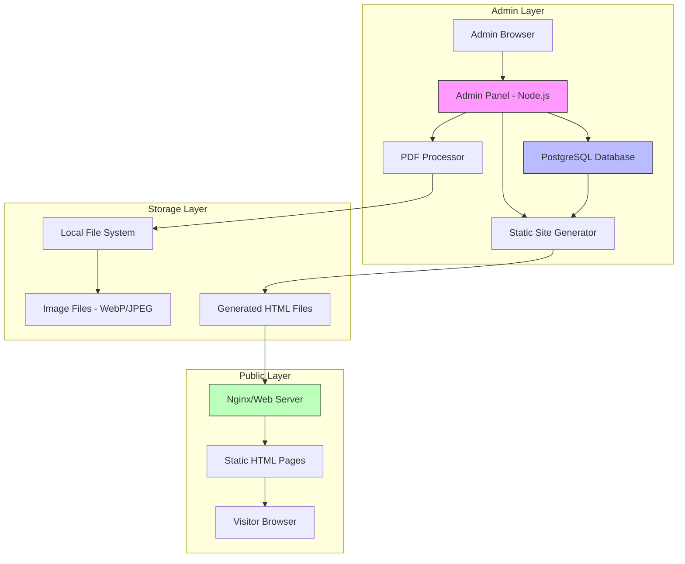
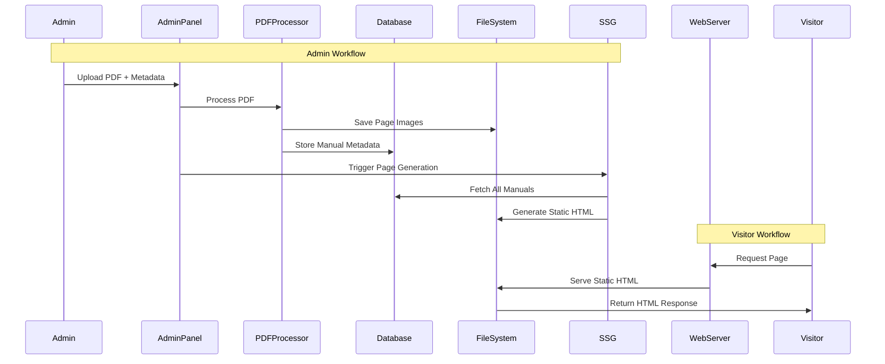
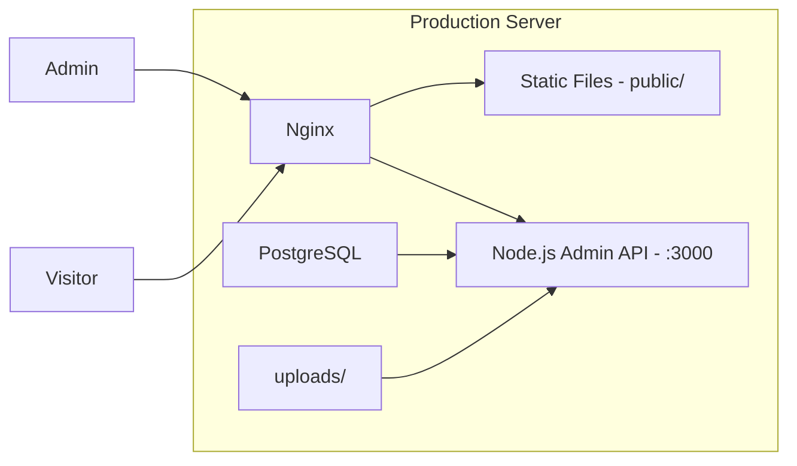

# Online Manual Viewer - Technical Design Document

Feature Name: online-manual-viewer
Updated: 2026-02-25

## Description

在线文档浏览系统，采用静态站点生成(SSG)架构，支持 PDF 手册上传、自动拆图、静态页面生成、广告位管理等功能。系统分为两部分：

1. **公开站点**：纯静态 HTML，高性能、SEO 友好
2. **管理后台**：Node.js 服务，提供 PDF 处理、数据管理、页面生成功能

---

## Architecture

### System Architecture Overview



### Request Flow



---

## Components and Interfaces

### 1. PDF Processor Module

**Responsibility**: Convert uploaded PDF files into individual page images

**Location**: `src/processor/pdf.js`

```javascript
// Interface Definition
interface PDFProcessor {
  // Split PDF into images
  split(pdfPath: string, outputDir: string): Promise<PageImage[]>;

  // Get PDF metadata (page count, dimensions)
  getMetadata(pdfPath: string): Promise<PDFMetadata>;

  // Optimize image (convert to WebP, compress)
  optimize(imagePath: string): Promise<string>;
}

interface PageImage {
  pageNumber: number;
  originalPath: string;
  webpPath: string;
  jpegPath: string;
  width: number;
  height: number;
  fileSize: number;
}

interface PDFMetadata {
  title: string;
  pageCount: number;
  pageSize: { width: number; height: number };
}
```

**Dependencies**:
- `pdf-poppler` or `pdf2pic` - PDF to image conversion
- `sharp` - Image optimization and WebP conversion

### 2. Static Site Generator (SSG)

**Responsibility**: Generate static HTML files from database content

**Location**: `src/generator/ssg.js`

```javascript
interface StaticSiteGenerator {
  // Generate all static pages
  generateAll(): Promise<void>;

  // Generate pages for a specific manual
  generateManual(manualId: string): Promise<void>;

  // Generate homepage
  generateHomepage(): Promise<void>;

  // Generate brand/category listing pages
  generateListings(): Promise<void>;

  // Generate sitemap.xml
  generateSitemap(): Promise<void>;
}
```

**Template Engine**: `ejs` or `nunjucks`

### 3. Admin Panel API

**Responsibility**: Provide backend API for admin operations

**Location**: `src/admin/`

```javascript
// API Endpoints
POST   /api/admin/login              // Admin authentication
POST   /api/admin/logout             // Admin logout
GET    /api/admin/dashboard          // Dashboard statistics

GET    /api/manuals                  // List all manuals
POST   /api/manuals                  // Create new manual
GET    /api/manuals/:id              // Get manual details
PUT    /api/manuals/:id              // Update manual metadata
DELETE /api/manuals/:id              // Delete manual

POST   /api/upload                   // Upload and process PDF

GET    /api/ads                      // List ad configurations
POST   /api/ads                      // Create ad config
PUT    /api/ads/:id                  // Update ad config
DELETE /api/ads/:id                  // Delete ad config

GET    /api/stats                    // Get access statistics
```

### 4. Admin Panel Frontend

**Responsibility**: Web UI for admin operations

**Location**: `src/admin/public/`

**Technology**: Vanilla JS or lightweight framework (Alpine.js)

**Features**:
- Login page
- Dashboard with statistics
- Manual management (upload, edit, delete)
- Ad slot management
- Statistics viewer

### 5. Statistics Collector

**Responsibility**: Collect and aggregate page view statistics

**Location**: `src/stats/collector.js`

```javascript
interface StatsCollector {
  // Record a page view (called via API endpoint)
  recordPageView(data: PageViewData): Promise<void>;

  // Aggregate daily statistics
  aggregateDaily(): Promise<void>;

  // Get statistics for dashboard
  getStats(period: 'day' | 'week' | 'month'): Promise<StatsResult>;
}

interface PageViewData {
  manualId: string;
  pageNumber: number;
  timestamp: Date;
  ip: string;
  userAgent: string;
  referrer: string;
}
```

---

## Data Models

### PostgreSQL Schema

```sql
-- Manuals Table
CREATE TABLE manuals (
    id SERIAL PRIMARY KEY,
    slug VARCHAR(255) UNIQUE NOT NULL,
    title VARCHAR(255) NOT NULL,
    brand VARCHAR(100) NOT NULL,
    model VARCHAR(100) NOT NULL,
    category VARCHAR(100),
    description TEXT,
    page_count INTEGER NOT NULL DEFAULT 0,
    language VARCHAR(10) DEFAULT 'en',
    status VARCHAR(20) DEFAULT 'draft', -- draft, published, archived
    created_at TIMESTAMP DEFAULT CURRENT_TIMESTAMP,
    updated_at TIMESTAMP DEFAULT CURRENT_TIMESTAMP,
    published_at TIMESTAMP,

    INDEX idx_brand (brand),
    INDEX idx_model (model),
    INDEX idx_status (status)
);

-- Pages Table
CREATE TABLE pages (
    id SERIAL PRIMARY KEY,
    manual_id INTEGER REFERENCES manuals(id) ON DELETE CASCADE,
    page_number INTEGER NOT NULL,
    image_webp VARCHAR(255) NOT NULL,
    image_jpeg VARCHAR(255) NOT NULL,
    image_width INTEGER,
    image_height INTEGER,
    section_title VARCHAR(255),
    section_description TEXT,
    seo_title VARCHAR(255),
    seo_description TEXT,
    created_at TIMESTAMP DEFAULT CURRENT_TIMESTAMP,

    UNIQUE(manual_id, page_number),
    INDEX idx_manual_page (manual_id, page_number)
);

-- Table of Contents
CREATE TABLE toc_entries (
    id SERIAL PRIMARY KEY,
    manual_id INTEGER REFERENCES manuals(id) ON DELETE CASCADE,
    title VARCHAR(255) NOT NULL,
    start_page INTEGER NOT NULL,
    end_page INTEGER NOT NULL,
    sort_order INTEGER DEFAULT 0
);

-- Ad Configurations
CREATE TABLE ad_slots (
    id SERIAL PRIMARY KEY,
    slot_name VARCHAR(50) NOT NULL, -- 'top-banner', 'left-sidebar', etc.
    slot_type VARCHAR(50) NOT NULL, -- 'adsense', 'custom'
    ad_code TEXT,
    is_active BOOLEAN DEFAULT true,
    targeting JSONB, -- {"brands": ["Atlas Copco"], "manuals": [1,2,3]}
    created_at TIMESTAMP DEFAULT CURRENT_TIMESTAMP,
    updated_at TIMESTAMP DEFAULT CURRENT_TIMESTAMP
);

-- Page Views (Raw)
CREATE TABLE page_views_raw (
    id BIGSERIAL PRIMARY KEY,
    manual_id INTEGER REFERENCES manuals(id),
    page_number INTEGER,
    ip_address VARCHAR(45),
    user_agent TEXT,
    referrer TEXT,
    viewed_at TIMESTAMP DEFAULT CURRENT_TIMESTAMP
);

-- Page Views (Aggregated)
CREATE TABLE page_views_daily (
    id SERIAL PRIMARY KEY,
    manual_id INTEGER REFERENCES manuals(id),
    page_number INTEGER,
    view_date DATE NOT NULL,
    view_count INTEGER DEFAULT 0,

    UNIQUE(manual_id, page_number, view_date)
);

-- Admin Sessions
CREATE TABLE admin_sessions (
    id SERIAL PRIMARY KEY,
    token_hash VARCHAR(255) NOT NULL,
    ip_address VARCHAR(45),
    created_at TIMESTAMP DEFAULT CURRENT_TIMESTAMP,
    expires_at TIMESTAMP NOT NULL
);

-- Admin Logs
CREATE TABLE admin_logs (
    id SERIAL PRIMARY KEY,
    action VARCHAR(50) NOT NULL,
    entity_type VARCHAR(50),
    entity_id INTEGER,
    details JSONB,
    ip_address VARCHAR(45),
    created_at TIMESTAMP DEFAULT CURRENT_TIMESTAMP
);

-- Site Settings
CREATE TABLE site_settings (
    key VARCHAR(100) PRIMARY KEY,
    value TEXT,
    updated_at TIMESTAMP DEFAULT CURRENT_TIMESTAMP
);
```

---

## Directory Structure

```
project-root/
├── src/
│   ├── processor/
│   │   ├── pdf.js              # PDF splitting logic
│   │   └── image.js            # Image optimization
│   ├── generator/
│   │   ├── ssg.js              # Static site generator
│   │   └── templates/          # EJS/Nunjucks templates
│   │       ├── layout.html
│   │       ├── page.html
│   │       ├── homepage.html
│   │       ├── brand-list.html
│   │       └── partials/
│   │           ├── header.html
│   │           ├── footer.html
│   │           ├── breadcrumbs.html
│   │           └── ad-slot.html
│   ├── admin/
│   │   ├── server.js           # Express server
│   │   ├── routes/
│   │   │   ├── auth.js
│   │   │   ├── manuals.js
│   │   │   ├── ads.js
│   │   │   └── stats.js
│   │   ├── middleware/
│   │   │   └── auth.js
│   │   └── public/             # Admin panel frontend
│   │       ├── index.html
│   │       ├── css/
│   │       └── js/
│   ├── stats/
│   │   ├── collector.js
│   │   └── aggregator.js
│   └── config/
│       └── index.js            # Configuration management
├── public/                     # Generated static site
│   ├── index.html
│   ├── manual/
│   │   └── {brand}/
│   │       └── {model}/
│   │           ├── page-1.html
│   │           ├── page-2.html
│   │           └── ...
│   ├── brand/
│   ├── images/
│   │   └── manuals/
│   │       └── {manual-id}/
│   │           ├── page-1.webp
│   │           ├── page-1.jpg
│   │           └── ...
│   ├── css/
│   ├── js/
│   └── sitemap.xml
├── uploads/                    # Temporary upload directory
├── scripts/
│   ├── generate.js             # CLI for SSG
│   └── migrate.js              # Database migrations
├── package.json
├── .env.example
└── nginx.conf.example
```

---

## Page Template Structure

Based on existing HTML files, each generated page follows this structure:

```html
<!DOCTYPE html>
<html lang="en">
<head>
    <meta charset="UTF-8">
    <meta name="viewport" content="width=device-width, initial-scale=1.0">
    <title>Model ABC-123 Service Manual | Page 5</title>
    <meta name="description" content="Page 5 of ABC-123 service manual, showing pressure settings and troubleshooting.">

    <!-- Open Graph -->
    <meta property="og:title" content="Model ABC-123 Service Manual | Page 5">
    <meta property="og:description" content="Page 5 of ABC-123 service manual...">
    <meta property="og:image" content="https://example.com/images/manuals/123/page-5.jpg">
    <meta property="og:url" content="https://example.com/manual/brand/model/page-5">

    <!-- Canonical -->
    <link rel="canonical" href="https://example.com/manual/brand/model/page-5">

    <!-- Schema.org -->
    <script type="application/ld+json">
    {
        "@context": "https://schema.org",
        "@type": "Article",
        "headline": "Model ABC-123 Service Manual - Page 5",
        "description": "Page 5 of ABC-123 service manual...",
        "image": "https://example.com/images/manuals/123/page-5.jpg"
    }
    </script>

    <style>/* Inline critical CSS */</style>
</head>
<body>
    <!-- Header with Logo -->
    <header>...</header>

    <!-- Top Ad Banner (728x90) -->
    <div class="ad-top">ADSENSE CODE</div>

    <!-- Breadcrumbs -->
    <nav class="breadcrumbs">
        <a href="/">Home</a> &gt;
        <a href="/brand/atlas-copco">Atlas Copco</a> &gt;
        <a href="/manual/atlas-copco/ga-37/page-1">GA 37</a> &gt;
        <span>Page 5</span>
    </nav>

    <!-- Main Content Grid -->
    <div class="main-grid">
        <!-- Left Sidebar: TOC + Ad (300x600) -->
        <aside class="sidebar-left">
            <div class="toc">...</div>
            <div class="ad-sidebar">ADSENSE CODE</div>
        </aside>

        <!-- Center: Page Image -->
        <main class="content-area">
            <div class="page-image-wrapper">
                
                <div class="watermark-overlay"></div>
            </div>

            <!-- Pagination -->
            <div class="pagination">
                <a href="page-4.html">Previous</a>
                <span>Page 5 of 64</span>
                <a href="page-6.html">Next</a>
            </div>

            <!-- SEO Text -->
            <div class="seo-text">...</div>
        </main>

        <!-- Right Sidebar: Related + Ad (300x600) -->
        <aside class="sidebar-right">
            <div class="related">...</div>
            <div class="ad-sidebar">ADSENSE CODE</div>
        </aside>
    </div>

    <!-- Bottom Ad Banner (728x90) -->
    <div class="ad-bottom">ADSENSE CODE</div>

    <!-- Footer -->
    <footer>...</footer>
</body>
</html>
```

---

## Ad Slot Configuration

| Slot Name | Position | Size | Responsive Behavior |
|-----------|----------|------|---------------------|
| top-banner | Header below | 728x90 | Stays visible on all sizes |
| left-sidebar | Left column | 300x600 | Hidden on mobile (<768px) |
| right-sidebar | Right column | 300x600 | Hidden on tablet (<1024px) |
| bottom-banner | Above footer | 728x90 | Stays visible on all sizes |

---

## Correctness Properties

### Invariants

1. **Page Number Consistency**: For any manual M with page_count P, there exist exactly P pages in the pages table with manual_id = M.id
2. **Image File Existence**: For every page record, the referenced image files MUST exist in the filesystem
3. **URL Slug Uniqueness**: Each manual MUST have a unique slug
4. **Page Sequence**: Page numbers for a manual MUST be sequential starting from 1
5. **TOC Consistency**: TOC entry page ranges MUST be within the manual's total page count

### Constraints

1. Admin session expires after 24 hours of inactivity
2. PDF file size MUST not exceed 100MB
3. Image files MUST be optimized (WebP primary, JPEG fallback)
4. Generated HTML files MUST be valid HTML5

---

## Error Handling

### Error Categories

| Category | HTTP Status | Example | User Message |
|----------|-------------|---------|--------------|
| Validation | 400 | Invalid PDF format | "Please upload a valid PDF file" |
| Authentication | 401 | Session expired | "Please log in again" |
| Authorization | 403 | Invalid credentials | "Invalid username or password" |
| Not Found | 404 | Manual not found | "The requested manual was not found" |
| Conflict | 409 | Duplicate slug | "A manual with this identifier already exists" |
| Rate Limit | 429 | Too many attempts | "Too many attempts. Please wait 15 minutes" |
| Server Error | 500 | PDF processing failed | "An error occurred. Please try again" |

### Error Response Format

```json
{
    "error": {
        "code": "VALIDATION_ERROR",
        "message": "PDF file size exceeds maximum allowed (100MB)",
        "details": {
            "maxSize": "100MB",
            "actualSize": "150MB"
        }
    }
}
```

---

## Test Strategy

### Unit Tests

- PDF processor: Split accuracy, image quality
- SSG: Template rendering, URL generation
- Admin API: Authentication, CRUD operations
- Statistics: Aggregation accuracy

### Integration Tests

- Full upload workflow: Upload → Process → Generate → Verify
- Admin panel: Login → Create manual → Verify public pages
- Ad targeting: Configure ads → Verify correct placement

### Performance Tests

- Page load time: < 1.5s FCP, < 2.5s LCP
- PDF processing: 100-page PDF in < 60 seconds
- SSG generation: 1000 manuals in < 5 minutes

### SEO Tests

- Google Rich Results Test: Schema.org validation
- Lighthouse SEO audit: Score > 90
- Mobile-friendly test: Pass

---

## Deployment Architecture



### Nginx Configuration

```nginx
server {
    listen 80;
    server_name example.com;
    root /var/www/manual-viewer/public;

    # Serve static files
    location / {
        try_files $uri $uri/ =404;
        expires 1y;
        add_header Cache-Control "public, immutable";
    }

    # Images with long cache
    location /images/ {
        expires 1y;
        add_header Cache-Control "public, immutable";
    }

    # Admin API proxy
    location /api/ {
        proxy_pass http://127.0.0.1:3000;
        proxy_http_version 1.1;
        proxy_set_header Host $host;
        proxy_set_header X-Real-IP $remote_addr;
    }

    # Admin panel
    location /admin {
        proxy_pass http://127.0.0.1:3000;
    }

    # Statistics endpoint (lightweight)
    location /stats/record {
        proxy_pass http://127.0.0.1:3000;
    }
}
```

---

## Security Considerations

1. **Admin Authentication**:
   - Password stored as bcrypt hash (cost factor 12)
   - Session token: 256-bit random, hashed in database
   - HTTPS required for admin panel

2. **Input Validation**:
   - All user inputs sanitized
   - PDF files scanned for malicious content
   - File type validation by magic bytes

3. **Rate Limiting**:
   - Admin login: 5 attempts per minute per IP
   - API endpoints: 100 requests per minute per IP
   - Statistics recording: 10 requests per second per IP

4. **Content Security**:
   - Watermark overlay on all images
   - Right-click disabled on images
   - No direct PDF download links

---

## Performance Optimization

1. **Static Site Benefits**:
   - No database queries for public pages
   - CDN-ready (all static files)
   - Minimal server resource usage

2. **Image Optimization**:
   - WebP format with 80% quality
   - Responsive images with srcset
   - Lazy loading for below-fold images

3. **Critical CSS Inlining**:
   - Above-fold styles inlined
   - Non-critical styles loaded async

4. **Preconnect Hints**:
   - `<link rel="preconnect" href="https://pagead2.googlesyndication.com">`

---

## References

[^1]: (File) - index.html - Homepage design reference
[^2]: (File) - code (10).html - Page viewer design reference
[^3]: (Website) - [Google AdSense Policies](https://support.google.com/adsense/answer/48182)
[^4]: (Website) - [Schema.org Article](https://schema.org/Article)
[^5]: (Website) - [Web.dev Performance](https://web.dev/performance/)
