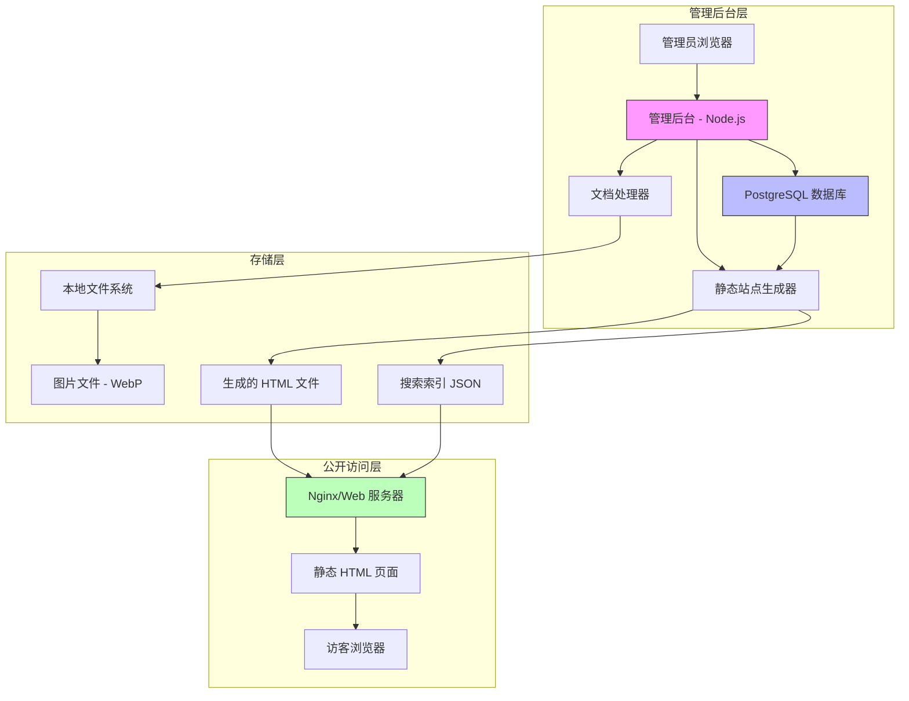
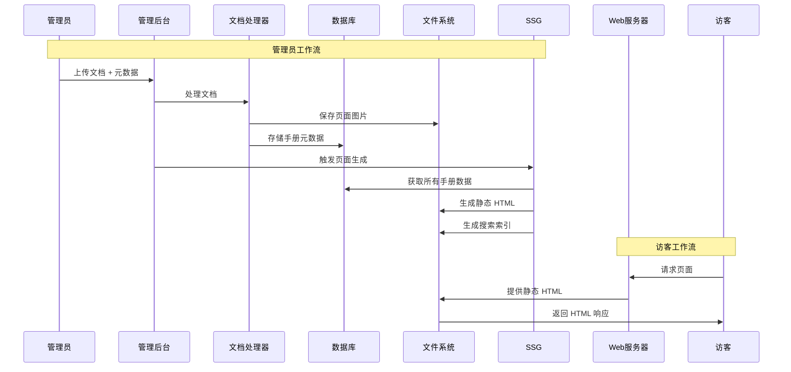
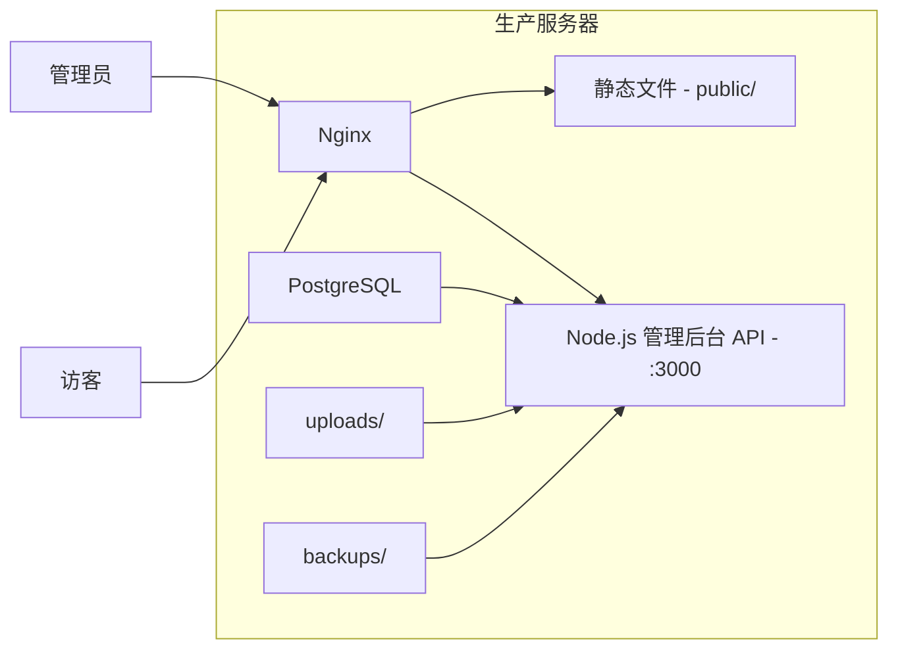

# 技术设计文档：在线文档浏览网站

功能名称：online-manual-viewer
更新日期：2026-02-25

## 项目概述

在线文档浏览系统，采用静态站点生成（SSG）架构，支持 PDF/PPT/Word 文档上传、自动拆图、静态页面生成、广告位管理等功能。系统分为两部分：

1. **公开站点**：纯静态 HTML，高性能、SEO 友好
2. **管理后台**：Node.js 服务，提供文档处理、数据管理、页面生成功能

**预估规模**：文档存储 100GB，支持 10,000+ 手册，1,000,000+ 页面

---

## 系统架构

### 系统架构概览



### 请求流程



---

## 组件与接口

### 1. 文档处理器模块

**职责**：将上传的 PDF/PPT/Word 文件转换为单页图片

**位置**：`src/processor/`

```javascript
// 接口定义
interface DocumentProcessor {
  // 拆分文档为图片
  split(filePath: string, outputDir: string): Promise<PageImage[]>;

  // 获取文档元数据（页数、尺寸）
  getMetadata(filePath: string): Promise<DocumentMetadata>;

  // 优化图片（转换为 WebP，压缩）
  optimize(imagePath: string): Promise<string>;
}

interface PageImage {
  pageNumber: number;
  originalPath: string;
  webpPath: string;
  width: number;
  height: number;
  fileSize: number;
}

interface DocumentMetadata {
  title: string;
  pageCount: number;
  pageSize: { width: number; height: number };
  fileType: 'pdf' | 'ppt' | 'pptx' | 'doc' | 'docx';
}
```

**处理器实现**：

| 文件类型 | 处理器 | 依赖库 |
|---------|--------|--------|
| PDF | `src/processor/pdf.js` | `pdf2pic` + `sharp` |
| PPT/PPTX | `src/processor/ppt.js` | LibreOffice + `sharp` |
| DOC/DOCX | `src/processor/doc.js` | LibreOffice + `sharp` |

**依赖项**：
- `pdf2pic` - PDF 转图片
- `sharp` - 图片优化和 WebP 转换
- `libreoffice` - Office 文档转图片（系统级依赖）

### 2. 静态站点生成器（SSG）

**职责**：从数据库内容生成静态 HTML 文件

**位置**：`src/generator/ssg.js`

```javascript
interface StaticSiteGenerator {
  // 生成所有静态页面
  generateAll(): Promise<void>;

  // 生成指定手册的页面
  generateManual(manualId: string): Promise<void>;

  // 生成首页
  generateHomepage(): Promise<void>;

  // 生成品牌/分类列表页
  generateListings(): Promise<void>;

  // 生成 sitemap.xml
  generateSitemap(): Promise<void>;

  // 生成搜索索引
  generateSearchIndex(): Promise<void>;
}
```

**模板引擎**：`ejs` 或 `nunjucks`

### 3. 管理后台 API

**职责**：为管理操作提供后端 API

**位置**：`src/admin/`

```javascript
// API 端点
POST   /api/admin/login              // 管理员认证
POST   /api/admin/logout             // 管理员登出
GET    /api/admin/dashboard          // 仪表盘统计
POST   /api/admin/reauth             // 敏感操作重新认证

GET    /api/manuals                  // 列出所有手册
POST   /api/manuals                  // 创建新手册
GET    /api/manuals/:id              // 获取手册详情
PUT    /api/manuals/:id              // 更新手册元数据
DELETE /api/manuals/:id              // 删除手册

POST   /api/upload                   // 上传并处理文档

GET    /api/ads                      // 列出广告配置
POST   /api/ads                      // 创建广告配置
PUT    /api/ads/:id                  // 更新广告配置
DELETE /api/ads/:id                  // 删除广告配置

GET    /api/stats                    // 获取访问统计

GET    /api/backup                   // 获取备份列表
POST   /api/backup                   // 手动触发备份
GET    /api/backup/:id/download      // 下载备份文件
```

### 4. 管理后台前端

**职责**：管理操作的 Web 界面

**位置**：`src/admin/public/`

**技术选型**：原生 JS 或轻量框架（Alpine.js）

**功能模块**：
- 登录页面
- 仪表盘（统计数据）
- 手册管理（上传、编辑、删除）
- 广告位管理
- 统计数据查看
- 备份管理

### 5. 统计收集器

**职责**：收集和聚合页面访问统计

**位置**：`src/stats/collector.js`

```javascript
interface StatsCollector {
  // 记录页面访问（通过 API 端点调用）
  recordPageView(data: PageViewData): Promise<void>;

  // 聚合每日统计
  aggregateDaily(): Promise<void>;

  // 获取仪表盘统计
  getStats(period: 'day' | 'week' | 'month'): Promise<StatsResult>;
}

interface PageViewData {
  manualId: string;
  pageNumber: number;
  timestamp: Date;
  ip: string;
  userAgent: string;
  referrer: string;
}
```

### 6. 前端搜索模块

**职责**：在访客端提供快速的手册搜索功能

**位置**：`public/js/search.js`

```javascript
interface FrontendSearch {
  // 初始化搜索索引
  init(): Promise<void>;

  // 搜索手册
  search(query: string): SearchResult[];

  // 高亮匹配关键词
  highlight(text: string, query: string): string;
}

interface SearchResult {
  manualId: string;
  title: string;
  brand: string;
  model: string;
  category: string;
  url: string;
  highlights: string[];
}
```

**搜索索引结构**（`public/data/search-index.json`）：

```json
{
  "version": "20260225",
  "manuals": [
    {
      "id": 1,
      "title": "ABC-123 服务手册",
      "brand": "Atlas Copco",
      "model": "GA 37",
      "category": "空压机",
      "url": "/manual/atlas-copco/ga-37/page-1"
    }
  ]
}
```

### 7. 备份模块

**职责**：自动和手动备份数据库及图片文件

**位置**：`src/backup/manager.js`

```javascript
interface BackupManager {
  // 执行完整备份
  createBackup(): Promise<BackupResult>;

  // 恢复备份
  restoreBackup(backupId: string): Promise<void>;

  // 清理旧备份
  cleanupOldBackups(): Promise<void>;

  // 获取备份列表
  listBackups(): Promise<BackupInfo[]>;
}

interface BackupResult {
  id: string;
  timestamp: Date;
  databaseFile: string;
  imagesArchive: string;
  size: number;
}

interface BackupInfo {
  id: string;
  timestamp: Date;
  size: number;
  status: 'success' | 'failed';
}
```

**备份策略**：
- 每周自动执行一次完整备份
- 保留最近 4 周的备份文件
- 备份内容：数据库 + 图片目录
- 存储位置：`/var/backups/manual-viewer/`

---

## 数据模型

### PostgreSQL 数据库结构

```sql
-- 手册表
CREATE TABLE manuals (
    id SERIAL PRIMARY KEY,
    slug VARCHAR(255) UNIQUE NOT NULL,
    title VARCHAR(255) NOT NULL,
    brand VARCHAR(100) NOT NULL,
    model VARCHAR(100) NOT NULL,
    category VARCHAR(100),
    description TEXT,
    page_count INTEGER NOT NULL DEFAULT 0,
    file_type VARCHAR(20) DEFAULT 'pdf', -- pdf, ppt, pptx, doc, docx
    language VARCHAR(10) DEFAULT 'zh',
    status VARCHAR(20) DEFAULT 'draft', -- draft, published, archived
    created_at TIMESTAMP DEFAULT CURRENT_TIMESTAMP,
    updated_at TIMESTAMP DEFAULT CURRENT_TIMESTAMP,
    published_at TIMESTAMP,

    INDEX idx_brand (brand),
    INDEX idx_model (model),
    INDEX idx_status (status),
    INDEX idx_category (category)
);

-- 页面表
CREATE TABLE pages (
    id SERIAL PRIMARY KEY,
    manual_id INTEGER REFERENCES manuals(id) ON DELETE CASCADE,
    page_number INTEGER NOT NULL,
    image_webp VARCHAR(255) NOT NULL,
    image_width INTEGER,
    image_height INTEGER,
    section_title VARCHAR(255),
    section_description TEXT,
    seo_title VARCHAR(255),
    seo_description TEXT,
    created_at TIMESTAMP DEFAULT CURRENT_TIMESTAMP,

    UNIQUE(manual_id, page_number),
    INDEX idx_manual_page (manual_id, page_number)
);

-- 目录表
CREATE TABLE toc_entries (
    id SERIAL PRIMARY KEY,
    manual_id INTEGER REFERENCES manuals(id) ON DELETE CASCADE,
    title VARCHAR(255) NOT NULL,
    start_page INTEGER NOT NULL,
    end_page INTEGER NOT NULL,
    sort_order INTEGER DEFAULT 0
);

-- 广告配置表
CREATE TABLE ad_slots (
    id SERIAL PRIMARY KEY,
    slot_name VARCHAR(50) NOT NULL, -- 'top-banner', 'left-sidebar' 等
    slot_type VARCHAR(50) NOT NULL, -- 'baidu', '360', 'adsense', 'custom'
    ad_code TEXT,
    is_active BOOLEAN DEFAULT true,
    targeting JSONB, -- {"brands": ["品牌名"], "manuals": [1,2,3]}
    created_at TIMESTAMP DEFAULT CURRENT_TIMESTAMP,
    updated_at TIMESTAMP DEFAULT CURRENT_TIMESTAMP
);

-- 访问记录（原始）
CREATE TABLE page_views_raw (
    id BIGSERIAL PRIMARY KEY,
    manual_id INTEGER REFERENCES manuals(id),
    page_number INTEGER,
    ip_address VARCHAR(45),
    user_agent TEXT,
    referrer TEXT,
    viewed_at TIMESTAMP DEFAULT CURRENT_TIMESTAMP
);

-- 访问统计（按日聚合）
CREATE TABLE page_views_daily (
    id SERIAL PRIMARY KEY,
    manual_id INTEGER REFERENCES manuals(id),
    page_number INTEGER,
    view_date DATE NOT NULL,
    view_count INTEGER DEFAULT 0,

    UNIQUE(manual_id, page_number, view_date)
);

-- 管理员会话表
CREATE TABLE admin_sessions (
    id SERIAL PRIMARY KEY,
    token_hash VARCHAR(255) NOT NULL,
    ip_address VARCHAR(45),
    created_at TIMESTAMP DEFAULT CURRENT_TIMESTAMP,
    expires_at TIMESTAMP NOT NULL
);

-- 管理员操作日志表
CREATE TABLE admin_logs (
    id SERIAL PRIMARY KEY,
    action VARCHAR(50) NOT NULL,
    entity_type VARCHAR(50),
    entity_id INTEGER,
    details JSONB,
    ip_address VARCHAR(45),
    created_at TIMESTAMP DEFAULT CURRENT_TIMESTAMP
);

-- 备份记录表
CREATE TABLE backup_records (
    id SERIAL PRIMARY KEY,
    backup_id VARCHAR(100) UNIQUE NOT NULL,
    type VARCHAR(20) DEFAULT 'scheduled', -- scheduled, manual
    database_path VARCHAR(255),
    images_path VARCHAR(255),
    size_bytes BIGINT,
    status VARCHAR(20) DEFAULT 'pending', -- pending, success, failed
    error_message TEXT,
    started_at TIMESTAMP DEFAULT CURRENT_TIMESTAMP,
    completed_at TIMESTAMP
);

-- 网站设置表
CREATE TABLE site_settings (
    key VARCHAR(100) PRIMARY KEY,
    value TEXT,
    updated_at TIMESTAMP DEFAULT CURRENT_TIMESTAMP
);
```

---

## 目录结构

```
project-root/
├── src/
│   ├── processor/
│   │   ├── index.js             # 文档处理器入口
│   │   ├── pdf.js               # PDF 拆分逻辑
│   │   ├── ppt.js               # PPT 拆分逻辑
│   │   ├── doc.js               # Word 拆分逻辑
│   │   └── image.js             # 图片优化
│   ├── generator/
│   │   ├── ssg.js               # 静态站点生成器
│   │   ├── search-index.js      # 搜索索引生成
│   │   └── templates/           # EJS/Nunjucks 模板
│   │       ├── layout.html
│   │       ├── page.html
│   │       ├── homepage.html
│   │       ├── brand-list.html
│   │       └── partials/
│   │           ├── header.html
│   │           ├── footer.html
│   │           ├── breadcrumbs.html
│   │           ├── ad-slot.html
│   │           └── search.html
│   ├── admin/
│   │   ├── server.js            # Express 服务器
│   │   ├── routes/
│   │   │   ├── auth.js
│   │   │   ├── manuals.js
│   │   │   ├── ads.js
│   │   │   ├── stats.js
│   │   │   └── backup.js
│   │   ├── middleware/
│   │   │   └── auth.js
│   │   └── public/              # 管理后台前端
│   │       ├── index.html
│   │       ├── css/
│   │       └── js/
│   ├── stats/
│   │   ├── collector.js
│   │   └── aggregator.js
│   ├── backup/
│   │   ├── manager.js
│   │   └── scheduler.js
│   └── config/
│       └── index.js             # 配置管理
├── public/                      # 生成的静态站点
│   ├── index.html
│   ├── manual/
│   │   └── {brand}/
│   │       └── {model}/
│   │           ├── page-1.html
│   │           ├── page-2.html
│   │           └── ...
│   ├── brand/
│   ├── images/
│   │   └── manuals/
│   │       └── {manual-id}/
│   │           ├── page-1.webp
│   │           └── ...
│   ├── data/
│   │   └── search-index.json    # 前端搜索索引
│   ├── css/
│   ├── js/
│   │   ├── main.js
│   │   ├── search.js
│   │   └── navigation.js
│   └── sitemap.xml
├── uploads/                     # 临时上传目录
├── backups/                     # 备份存储目录
├── scripts/
│   ├── generate.js              # SSG 命令行工具
│   ├── migrate.js               # 数据库迁移
│   └── backup.js                # 备份命令行工具
├── package.json
├── .env.example
└── nginx.conf.example
```

---

## 页面模板结构

基于现有 HTML 文件，每个生成的页面遵循以下结构：

```html
<!DOCTYPE html>
<html lang="zh-CN">
<head>
    <meta charset="UTF-8">
    <meta name="viewport" content="width=device-width, initial-scale=1.0">
    <title>ABC-123型服务手册 | 第5页</title>
    <meta name="description" content="ABC-123服务手册第5页，包含压力设置和故障排除内容。">

    <!-- Open Graph -->
    <meta property="og:title" content="ABC-123型服务手册 | 第5页">
    <meta property="og:description" content="ABC-123服务手册第5页...">
    <meta property="og:image" content="https://example.com/images/manuals/123/page-5.webp">
    <meta property="og:url" content="https://example.com/manual/brand/model/page-5">

    <!-- 规范 URL -->
    <link rel="canonical" href="https://example.com/manual/brand/model/page-5">

    <!-- Schema.org -->
    <script type="application/ld+json">
    {
        "@context": "https://schema.org",
        "@type": "Article",
        "headline": "ABC-123型服务手册 - 第5页",
        "description": "ABC-123服务手册第5页...",
        "image": "https://example.com/images/manuals/123/page-5.webp"
    }
    </script>

    <style>/* 内联关键 CSS */</style>
</head>
<body>
    <!-- 顶部 Logo 和搜索 -->
    <header>
        <div class="logo">...</div>
        <div class="search">
            <input type="text" id="search-input" placeholder="搜索手册...">
            <div id="search-results"></div>
        </div>
    </header>

    <!-- 顶部广告横幅 (728x90) -->
    <div class="ad-top">广告代码</div>

    <!-- 面包屑导航 -->
    <nav class="breadcrumbs">
        <a href="/">首页</a> &gt;
        <a href="/brand/atlas-copco">Atlas Copco</a> &gt;
        <a href="/manual/atlas-copco/ga-37/page-1">GA 37</a> &gt;
        <span>第5页</span>
    </nav>

    <!-- 主内容网格 -->
    <div class="main-grid">
        <!-- 左侧边栏：目录 + 广告 (300x600) -->
        <aside class="sidebar-left">
            <div class="toc">...</div>
            <div class="ad-sidebar">广告代码</div>
        </aside>

        <!-- 中间：页面图片 -->
        <main class="content-area">
            <div class="page-image-wrapper">
                
                <div class="watermark-overlay"></div>
            </div>

            <!-- 分页导航 -->
            <div class="pagination">
                <a href="page-4.html">上一页</a>
                <span>第 5 页 / 共 64 页</span>
                <a href="page-6.html">下一页</a>
            </div>

            <!-- SEO 文本 -->
            <div class="seo-text">...</div>
        </main>

        <!-- 右侧边栏：相关手册 + 广告 (300x600) -->
        <aside class="sidebar-right">
            <div class="related">...</div>
            <div class="ad-sidebar">广告代码</div>
        </aside>
    </div>

    <!-- 底部广告横幅 (728x90) -->
    <div class="ad-bottom">广告代码</div>

    <!-- 页脚 -->
    <footer>...</footer>

    <!-- 搜索功能 -->
    <script src="/js/search.js"></script>
    <script>
        // 初始化搜索
        FrontendSearch.init();
    </script>
</body>
</html>
```

---

## 广告位配置

| 广告位名称 | 位置 | 尺寸 | 响应式行为 |
|-----------|------|------|-----------|
| top-banner | 头部下方 | 728x90 | 所有尺寸保持可见 |
| left-sidebar | 左侧栏 | 300x600 | 移动端隐藏 (<768px) |
| right-sidebar | 右侧栏 | 300x600 | 平板隐藏 (<1024px) |
| bottom-banner | 页脚上方 | 728x90 | 所有尺寸保持可见 |

**支持的广告联盟**：
- 百度联盟
- 360联盟
- Google AdSense
- 自定义 HTML

---

## 正确性属性

### 不变式

1. **页码一致性**：对于任意手册 M 有 page_count P，pages 表中必须存在恰好 P 条记录，且 manual_id = M.id
2. **图片文件存在性**：每条页面记录引用的图片文件必须存在于文件系统中
3. **URL Slug 唯一性**：每个手册必须有唯一的 slug
4. **页码序列**：手册的页码必须从 1 开始连续编号
5. **目录一致性**：目录条目的页码范围必须在手册总页数范围内

### 约束条件

1. 管理员会话在 24 小时无活动后过期
2. 文档文件大小不得超过 200MB
3. 图片文件必须优化（WebP 格式）
4. 生成的 HTML 文件必须是有效的 HTML5
5. 敏感操作需要重新认证

---

## 错误处理

### 错误分类

| 分类 | HTTP 状态码 | 示例 | 用户提示 |
|------|------------|------|---------|
| 验证错误 | 400 | 文档格式无效 | "请上传有效的文档文件" |
| 认证错误 | 401 | 会话过期 | "请重新登录" |
| 授权错误 | 403 | 凭据无效 | "用户名或密码错误" |
| 未找到 | 404 | 手册不存在 | "请求的手册不存在" |
| 冲突 | 409 | Slug 重复 | "该标识符的手册已存在" |
| 频率限制 | 429 | 尝试次数过多 | "尝试次数过多，请等待 15 分钟" |
| 服务器错误 | 500 | 文档处理失败 | "发生错误，请重试" |

### 错误响应格式

```json
{
    "error": {
        "code": "VALIDATION_ERROR",
        "message": "文档文件大小超过最大限制 (200MB)",
        "details": {
            "maxSize": "200MB",
            "actualSize": "250MB"
        }
    }
}
```

---

## 测试策略

### 单元测试

- 文档处理器：拆分准确性、图片质量
- SSG：模板渲染、URL 生成
- 管理后台 API：认证、增删改查操作
- 统计模块：聚合准确性
- 搜索模块：索引生成、搜索准确性

### 集成测试

- 完整上传流程：上传 → 处理 → 生成 → 验证
- 管理后台：登录 → 创建手册 → 验证公开页面
- 广告定向：配置广告 → 验证正确展示
- 备份恢复：备份 → 删除数据 → 恢复 → 验证

### 性能测试

- 页面加载时间：FCP < 1.5s，LCP < 2.5s
- 文档处理：100 页 PDF < 60 秒
- SSG 生成：1000 本手册 < 5 分钟
- 搜索响应：前端搜索 < 100ms

### SEO 测试

- Google 富媒体结果测试：Schema.org 验证
- Lighthouse SEO 审计：分数 > 90
- 移动端友好测试：通过

---

## 部署架构



### Nginx 配置

```nginx
server {
    listen 80;
    server_name example.com;
    root /var/www/manual-viewer/public;

    # 安全头
    add_header X-Frame-Options "SAMEORIGIN" always;
    add_header X-Content-Type-Options "nosniff" always;
    add_header X-XSS-Protection "1; mode=block" always;

    # 提供静态文件
    location / {
        try_files $uri $uri/ =404;
        expires 1y;
        add_header Cache-Control "public, immutable";
    }

    # 图片长期缓存
    location /images/ {
        expires 1y;
        add_header Cache-Control "public, immutable";
    }

    # 搜索索引
    location /data/ {
        expires 1h;
        add_header Cache-Control "public";
    }

    # 管理后台 API 代理
    location /api/ {
        proxy_pass http://127.0.0.1:3000;
        proxy_http_version 1.1;
        proxy_set_header Host $host;
        proxy_set_header X-Real-IP $remote_addr;
    }

    # 管理后台面板
    location /admin {
        proxy_pass http://127.0.0.1:3000;
    }

    # 统计记录端点
    location /stats/record {
        proxy_pass http://127.0.0.1:3000;
    }
}
```

---

## 安全考量

### 管理员认证

- 密码使用 bcrypt 哈希存储（成本因子 12）
- 会话令牌：256 位随机数，数据库中存储哈希值
- 管理后台需要 HTTPS
- 会话 ID 每次请求重新生成
- 敏感操作需要重新认证

### 输入验证

- 所有用户输入进行消毒处理
- 文档文件扫描恶意内容
- 通过魔术字节验证文件类型
- 限制文件上传大小（200MB）

### 频率限制

- 管理员登录：每个 IP 每分钟 5 次
- API 端点：每个 IP 每分钟 100 次
- 统计记录：每个 IP 每秒 10 次

### 内容安全

- 所有图片添加水印覆盖层
- 图片禁用右键菜单
- 不提供文档直接下载链接
- HTML 中不包含原始文档 URL

### 安全头配置

- `X-Frame-Options: SAMEORIGIN`
- `X-Content-Type-Options: nosniff`
- `X-XSS-Protection: 1; mode=block`
- `Content-Security-Policy` (根据需要配置)

---

## 性能优化

### 静态站点优势

- 公开页面无需数据库查询
- 可部署到 CDN（所有静态文件）
- 服务器资源占用极低

### 图片优化

- WebP 格式，80% 质量
- 响应式图片使用 srcset
- 首屏以下图片懒加载
- 最小 150 DPI 输出质量

### 关键 CSS 内联

- 首屏样式内联
- 非关键样式异步加载

### 预连接提示

- `<link rel="preconnect" href="https://cpro.baidustatic.com">`
- `<link rel="preconnect" href="https://pagead2.googlesyndication.com">`

### 搜索索引优化

- 索引文件按需分块加载
- 大于 5MB 时分块压缩
- 使用 Web Worker 执行搜索

---

## 备份策略

### 自动备份

- 每周日凌晨 3:00 自动执行
- 备份内容：数据库 + 图片目录
- 保留最近 4 周的备份

### 备份文件命名

```
backup-YYYYMMDD-HHMMSS/
├── database.sql.gz
├── images.tar.gz
└── manifest.json
```

### 备份存储

- 本地存储：`/var/backups/manual-viewer/`
- 可选：同步到云存储（OSS/S3）

### 恢复流程

1. 解压数据库备份并导入
2. 解压图片目录到正确位置
3. 重新生成静态页面
4. 重新生成搜索索引

---

## 参考资料

[^1]: (文件) - index.html - 首页设计参考
[^2]: (文件) - code (10).html - 页面浏览设计参考
[^3]: (网站) - [百度联盟规范](https://union.baidu.com/)
[^4]: (网站) - [Schema.org Article](https://schema.org/Article)
[^5]: (网站) - [Web.dev 性能指南](https://web.dev/performance/)
[^6]: (网站) - [pdf2pic 文档](https://github.com/yakovmeister/pdf2pic)
[^7]: (网站) - [LibreOffice 命令行](https://www.libreoffice.org/)
