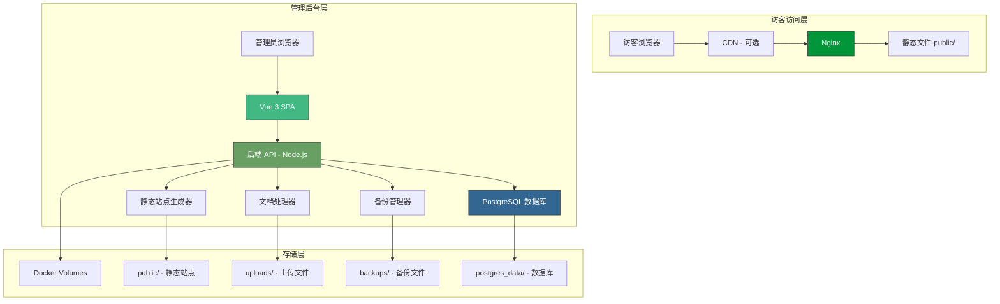
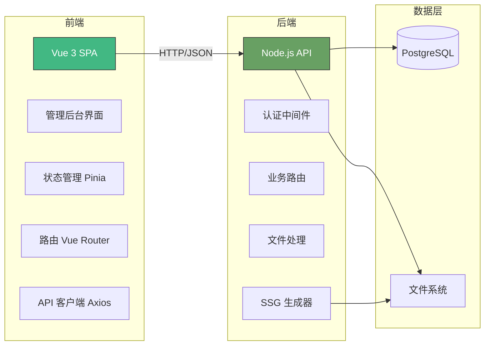
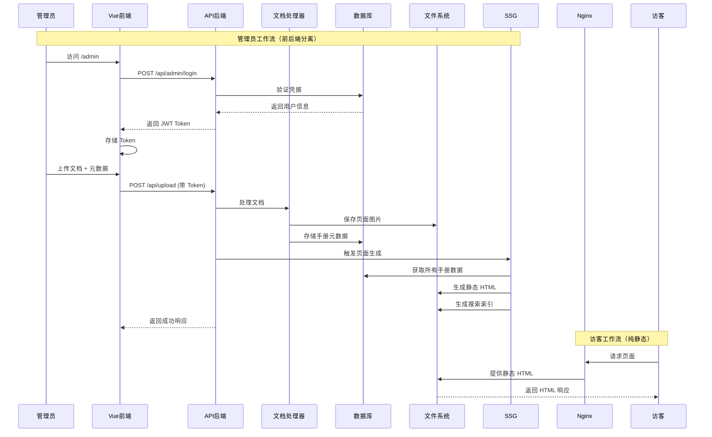
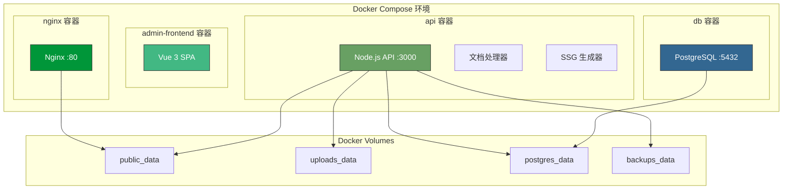
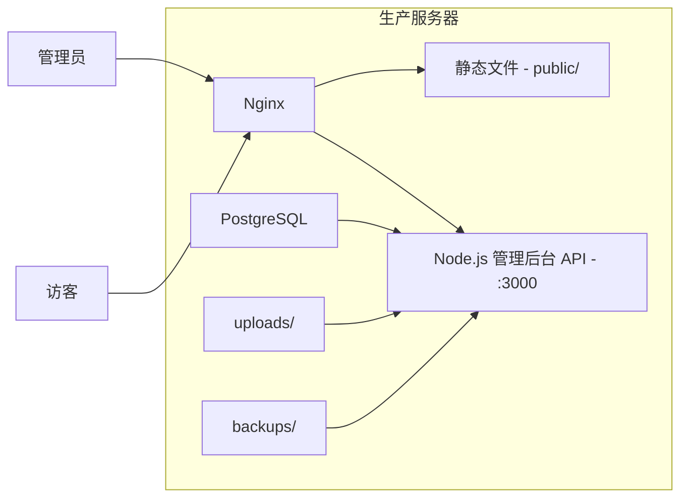

# 技术设计文档：在线文档浏览网站

功能名称：online-manual-viewer
更新日期：2026-02-25

## 项目概述

在线文档浏览系统，采用静态站点生成（SSG）架构，支持 PDF/PPT/Word 文档上传、自动拆图、静态页面生成、广告位管理等功能。

### 系统架构特点

1. **前后端分离**：管理后台采用 Vue 3 SPA，后端提供 RESTful API
2. **容器化部署**：Docker Compose 一键安装，环境一致性保障
3. **静态站点**：公开页面纯静态 HTML，高性能、SEO 友好
4. **一键迁移**：完整的备份恢复机制，支持跨环境迁移

### 系统组成

| 组件 | 类型 | 技术栈 | 说明 |
|------|------|--------|------|
| 公开站点 | 静态 HTML | Nginx | 访客浏览页面，SEO 优化 |
| 管理后台前端 | SPA | Vue 3 + Vite | 手册管理、广告配置、备份管理 |
| 后端 API | RESTful API | Node.js + Express | 业务逻辑、文档处理 |
| 数据库 | 关系型数据库 | PostgreSQL 15 | 元数据、用户、统计存储 |

**预估规模**：文档存储 100GB，支持 10,000+ 手册，1,000,000+ 页面

---

## 系统架构

### 整体架构概览



### 前后端分离架构



### 请求流程



### Docker 容器化架构



---

## Docker 容器化部署

### Docker Compose 配置

```yaml
# docker-compose.yml
version: '3.8'

services:
  # Nginx 反向代理
  nginx:
    image: nginx:alpine
    container_name: manual-nginx
    ports:
      - "80:80"
      - "443:443"
    volumes:
      - ./nginx.conf:/etc/nginx/nginx.conf:ro
      - ./ssl:/etc/nginx/ssl:ro
      - public_data:/var/www/public:ro
    depends_on:
      - api
    restart: unless-stopped
    networks:
      - manual-network

  # 管理后台前端（开发模式，生产环境可使用静态文件）
  admin-frontend:
    build:
      context: ./admin-frontend
      dockerfile: Dockerfile
    container_name: manual-admin
    ports:
      - "5173:5173"
    volumes:
      - ./admin-frontend:/app
      - /app/node_modules
    environment:
      - VITE_API_BASE_URL=http://api:3000
    depends_on:
      - api
    networks:
      - manual-network
    profiles:
      - dev  # 仅开发环境启用

  # 后端 API
  api:
    build:
      context: .
      dockerfile: Dockerfile
    container_name: manual-api
    ports:
      - "3000:3000"
    environment:
      - NODE_ENV=production
      - DATABASE_URL=postgres://manual:password@db:5432/manualdb
      - JWT_SECRET=${JWT_SECRET}
      - ADMIN_PASSWORD=${ADMIN_PASSWORD}
    volumes:
      - public_data:/app/public
      - uploads_data:/app/uploads
      - backups_data:/app/backups
    depends_on:
      db:
        condition: service_healthy
    restart: unless-stopped
    networks:
      - manual-network

  # PostgreSQL 数据库
  db:
    image: postgres:15-alpine
    container_name: manual-db
    environment:
      - POSTGRES_USER=manual
      - POSTGRES_PASSWORD=password
      - POSTGRES_DB=manualdb
    volumes:
      - postgres_data:/var/lib/postgresql/data
      - ./init.sql:/docker-entrypoint-initdb.d/init.sql:ro
    healthcheck:
      test: ["CMD-SHELL", "pg_isready -U manual -d manualdb"]
      interval: 10s
      timeout: 5s
      retries: 5
    restart: unless-stopped
    networks:
      - manual-network

  # 定时备份服务（可选）
  backup-scheduler:
    build:
      context: .
      dockerfile: Dockerfile.backup
    container_name: manual-backup
    environment:
      - DATABASE_URL=postgres://manual:password@db:5432/manualdb
      - BACKUP_SCHEDULE=0 3 * * 0  # 每周日凌晨3点
      - RETENTION_COUNT=4
    volumes:
      - postgres_data:/data/postgres:ro
      - uploads_data:/data/uploads:ro
      - backups_data:/backups
    depends_on:
      - db
    restart: unless-stopped
    networks:
      - manual-network
    profiles:
      - production

volumes:
  public_data:
  uploads_data:
  postgres_data:
  backups_data:

networks:
  manual-network:
    driver: bridge
```

### 后端 Dockerfile

```dockerfile
# Dockerfile
FROM node:20-alpine

# 安装 LibreOffice（用于 PPT/Word 转换）
RUN apk add --no-cache \
    libreoffice \
    imagemagick \
    ghostscript \
    poppler-utils

# 安装 pdf2pic 依赖
RUN apk add --no-cache \
    graphicsmagick \
    fftw

WORKDIR /app

# 安装依赖
COPY package*.json ./
RUN npm ci --only=production

# 复制源代码
COPY src/ ./src/
COPY scripts/ ./scripts/
COPY templates/ ./templates/

# 创建必要目录
RUN mkdir -p public uploads backups

# 初始化数据库并生成静态页面
COPY init.sql ./init.sql

EXPOSE 3000

CMD ["node", "src/server.js"]
```

### 一键安装脚本

```bash
#!/bin/bash
# install.sh - 一键安装脚本

set -e

echo "=========================================="
echo "  在线文档浏览系统 - 一键安装"
echo "=========================================="

# 检查 Docker
if ! command -v docker &> /dev/null; then
    echo "错误: 请先安装 Docker"
    exit 1
fi

if ! command -v docker-compose &> /dev/null; then
    echo "错误: 请先安装 Docker Compose"
    exit 1
fi

# 创建环境配置
if [ ! -f .env ]; then
    echo "创建环境配置文件..."
    cp .env.example .env

    # 生成随机密钥
    JWT_SECRET=$(openssl rand -hex 32)
    ADMIN_PASSWORD=$(openssl rand -base64 12)

    sed -i "s/JWT_SECRET=.*/JWT_SECRET=$JWT_SECRET/" .env
    sed -i "s/ADMIN_PASSWORD=.*/ADMIN_PASSWORD=$ADMIN_PASSWORD/" .env

    echo ""
    echo "重要: 请保存以下信息"
    echo "----------------------------------------"
    echo "管理员密码: $ADMIN_PASSWORD"
    echo "----------------------------------------"
fi

# 构建并启动服务
echo "构建 Docker 镜像..."
docker-compose build

echo "启动服务..."
docker-compose up -d

# 等待数据库就绪
echo "等待数据库初始化..."
sleep 10

# 初始化数据库
echo "初始化数据库..."
docker-compose exec api npm run migrate

# 生成初始静态页面
echo "生成静态页面..."
docker-compose exec api npm run generate

echo ""
echo "=========================================="
echo "  安装完成!"
echo "=========================================="
echo ""
echo "访问地址:"
echo "  公开站点: http://localhost"
echo "  管理后台: http://localhost/admin"
echo ""
echo "管理命令:"
echo "  查看日志: docker-compose logs -f"
echo "  停止服务: docker-compose down"
echo "  重启服务: docker-compose restart"
echo ""
```

---

## 组件与接口

### 1. 文档处理器模块

**职责**：将上传的 PDF/PPT/Word 文件转换为单页图片

**位置**：`src/processor/`

```javascript
// 接口定义
interface DocumentProcessor {
  // 拆分文档为图片
  split(filePath: string, outputDir: string): Promise<PageImage[]>;

  // 获取文档元数据（页数、尺寸）
  getMetadata(filePath: string): Promise<DocumentMetadata>;

  // 优化图片（转换为 WebP，压缩）
  optimize(imagePath: string): Promise<string>;
}

interface PageImage {
  pageNumber: number;
  originalPath: string;
  webpPath: string;
  width: number;
  height: number;
  fileSize: number;
}

interface DocumentMetadata {
  title: string;
  pageCount: number;
  pageSize: { width: number; height: number };
  fileType: 'pdf' | 'ppt' | 'pptx' | 'doc' | 'docx';
}
```

**处理器实现**：

| 文件类型 | 处理器 | 依赖库 |
|---------|--------|--------|
| PDF | `src/processor/pdf.js` | `pdf2pic` + `sharp` |
| PPT/PPTX | `src/processor/ppt.js` | LibreOffice + `sharp` |
| DOC/DOCX | `src/processor/doc.js` | LibreOffice + `sharp` |

**依赖项**：
- `pdf2pic` - PDF 转图片
- `sharp` - 图片优化和 WebP 转换
- `libreoffice` - Office 文档转图片（系统级依赖）

### 2. 静态站点生成器（SSG）

**职责**：从数据库内容生成静态 HTML 文件

**位置**：`src/generator/ssg.js`

```javascript
interface StaticSiteGenerator {
  // 生成所有静态页面
  generateAll(): Promise<void>;

  // 生成指定手册的页面
  generateManual(manualId: string): Promise<void>;

  // 生成首页
  generateHomepage(): Promise<void>;

  // 生成品牌/分类列表页
  generateListings(): Promise<void>;

  // 生成 sitemap.xml
  generateSitemap(): Promise<void>;

  // 生成搜索索引
  generateSearchIndex(): Promise<void>;
}
```

**模板引擎**：`ejs` 或 `nunjucks`

### 3. 管理后台 API

**职责**：为管理操作提供后端 API

**位置**：`src/admin/`

```javascript
// API 端点
POST   /api/admin/login              // 管理员认证
POST   /api/admin/logout             // 管理员登出
GET    /api/admin/dashboard          // 仪表盘统计
POST   /api/admin/reauth             // 敏感操作重新认证

GET    /api/manuals                  // 列出所有手册
POST   /api/manuals                  // 创建新手册
GET    /api/manuals/:id              // 获取手册详情
PUT    /api/manuals/:id              // 更新手册元数据
DELETE /api/manuals/:id              // 删除手册

POST   /api/upload                   // 上传并处理文档

GET    /api/ads                      // 列出广告配置
POST   /api/ads                      // 创建广告配置
PUT    /api/ads/:id                  // 更新广告配置
DELETE /api/ads/:id                  // 删除广告配置

GET    /api/stats                    // 获取访问统计

GET    /api/backup                   // 获取备份列表
POST   /api/backup                   // 手动触发备份
GET    /api/backup/:id/download      // 下载备份文件
```

### 4. 管理后台前端（Vue 3 SPA）

**职责**：管理操作的 Web 界面，前后端分离架构

**位置**：`admin-frontend/`

**技术选型**：Vue 3 + Vite + Pinia + Vue Router

**技术栈详情**：

| 技术 | 用途 | 版本 |
|------|------|------|
| Vue 3 | 前端框架 | ^3.4 |
| Vite | 构建工具 | ^5.0 |
| Pinia | 状态管理 | ^2.1 |
| Vue Router | 路由管理 | ^4.2 |
| Axios | HTTP 客户端 | ^1.6 |
| Element Plus | UI 组件库 | ^2.4 |
| VueUse | 组合式函数 | ^10.7 |

**功能模块**：

```
admin-frontend/src/
├── views/
│   ├── Login.vue              # 登录页面
│   ├── Dashboard.vue          # 仪表盘（统计数据）
│   ├── manuals/
│   │   ├── List.vue           # 手册列表
│   │   ├── Create.vue         # 创建手册
│   │   ├── Edit.vue           # 编辑手册
│   │   └── Upload.vue         # 上传文档
│   ├── ads/
│   │   ├── List.vue           # 广告位列表
│   │   └── Edit.vue           # 编辑广告
│   ├── stats/
│   │   └── Index.vue          # 统计数据
│   ├── backup/
│   │   ├── List.vue           # 备份列表
│   │   └── Settings.vue       # 备份设置
│   └── settings/
│       └── Index.vue          # 系统设置
├── components/
│   ├── layout/
│   │   ├── AppLayout.vue      # 布局组件
│   │   ├── Sidebar.vue        # 侧边栏
│   │   └── Header.vue         # 顶部栏
│   ├── manual/
│   │   ├── ManualCard.vue     # 手册卡片
│   │   └── UploadProgress.vue # 上传进度
│   └── common/
│       ├── Pagination.vue     # 分页组件
│       └── ConfirmDialog.vue  # 确认对话框
├── api/
│   ├── index.js               # API 客户端配置
│   ├── auth.js                # 认证 API
│   ├── manuals.js             # 手册 API
│   ├── ads.js                 # 广告 API
│   ├── stats.js               # 统计 API
│   └── backup.js              # 备份 API
├── stores/
│   ├── auth.js                # 认证状态
│   ├── manuals.js             # 手册状态
│   └── app.js                 # 应用状态
├── router/
│   └── index.js               # 路由配置
├── composables/
│   ├── useAuth.js             # 认证逻辑
│   ├── useNotification.js     # 通知逻辑
│   └── useUpload.js           # 上传逻辑
├── utils/
│   ├── request.js             # HTTP 请求封装
│   └── storage.js             # 本地存储
├── styles/
│   ├── variables.scss         # 样式变量
│   └── global.scss            # 全局样式
├── App.vue
└── main.js
```

**API 客户端配置**：

```javascript
// api/index.js
import axios from 'axios'
import { useAuthStore } from '@/stores/auth'
import { ElMessage } from 'element-plus'

const api = axios.create({
  baseURL: import.meta.env.VITE_API_BASE_URL || '/api',
  timeout: 30000,
  headers: {
    'Content-Type': 'application/json'
  }
})

// 请求拦截器 - 添加 Token
api.interceptors.request.use(
  (config) => {
    const authStore = useAuthStore()
    if (authStore.token) {
      config.headers.Authorization = `Bearer ${authStore.token}`
    }
    return config
  },
  (error) => Promise.reject(error)
)

// 响应拦截器 - 处理错误
api.interceptors.response.use(
  (response) => response.data,
  (error) => {
    if (error.response?.status === 401) {
      const authStore = useAuthStore()
      authStore.logout()
      window.location.href = '/admin/login'
    } else {
      ElMessage.error(error.response?.data?.message || '请求失败')
    }
    return Promise.reject(error)
  }
)

export default api
```

**路由配置**：

```javascript
// router/index.js
import { createRouter, createWebHistory } from 'vue-router'
import { useAuthStore } from '@/stores/auth'

const routes = [
  {
    path: '/login',
    name: 'Login',
    component: () => import('@/views/Login.vue'),
    meta: { requiresAuth: false }
  },
  {
    path: '/',
    component: () => import('@/components/layout/AppLayout.vue'),
    meta: { requiresAuth: true },
    children: [
      { path: '', name: 'Dashboard', component: () => import('@/views/Dashboard.vue') },
      { path: 'manuals', name: 'ManualList', component: () => import('@/views/manuals/List.vue') },
      { path: 'manuals/create', name: 'ManualCreate', component: () => import('@/views/manuals/Create.vue') },
      { path: 'manuals/:id/edit', name: 'ManualEdit', component: () => import('@/views/manuals/Edit.vue') },
      { path: 'ads', name: 'AdList', component: () => import('@/views/ads/List.vue') },
      { path: 'stats', name: 'Stats', component: () => import('@/views/stats/Index.vue') },
      { path: 'backup', name: 'Backup', component: () => import('@/views/backup/List.vue') },
      { path: 'settings', name: 'Settings', component: () => import('@/views/settings/Index.vue') }
    ]
  }
]

const router = createRouter({
  history: createWebHistory('/admin'),
  routes
})

// 路由守卫
router.beforeEach((to, from, next) => {
  const authStore = useAuthStore()
  if (to.meta.requiresAuth && !authStore.isAuthenticated) {
    next('/login')
  } else {
    next()
  }
})

export default router
```

**认证状态管理**：

```javascript
// stores/auth.js
import { defineStore } from 'pinia'
import { ref, computed } from 'vue'
import api from '@/api'
import router from '@/router'

export const useAuthStore = defineStore('auth', () => {
  const token = ref(localStorage.getItem('token') || null)
  const adminInfo = ref(JSON.parse(localStorage.getItem('adminInfo') || 'null'))

  const isAuthenticated = computed(() => !!token.value)

  async function login(password) {
    const res = await api.post('/admin/login', { password })
    token.value = res.token
    adminInfo.value = res.admin
    localStorage.setItem('token', res.token)
    localStorage.setItem('adminInfo', JSON.stringify(res.admin))
    return res
  }

  function logout() {
    token.value = null
    adminInfo.value = null
    localStorage.removeItem('token')
    localStorage.removeItem('adminInfo')
    router.push('/login')
  }

  async function reauth(password) {
    return await api.post('/admin/reauth', { password })
  }

  return { token, adminInfo, isAuthenticated, login, logout, reauth }
})
```

**构建配置**：

```javascript
// vite.config.js
import { defineConfig } from 'vite'
import vue from '@vitejs/plugin-vue'
import path from 'path'

export default defineConfig({
  plugins: [vue()],
  resolve: {
    alias: {
      '@': path.resolve(__dirname, 'src')
    }
  },
  server: {
    port: 5173,
    proxy: {
      '/api': {
        target: 'http://localhost:3000',
        changeOrigin: true
      }
    }
  },
  build: {
    outDir: 'dist',
    assetsDir: 'assets',
    sourcemap: false
  },
  base: '/admin/'
})
```

**生产环境部署**：

构建后的静态文件由 Nginx 直接服务：

```nginx
# 管理后台前端
location /admin {
    alias /var/www/admin;
    try_files $uri $uri/ /admin/index.html;
}

# 静态资源
location /admin/assets {
    alias /var/www/admin/assets;
    expires 1y;
    add_header Cache-Control "public, immutable";
}
```

### 5. 统计收集器

**职责**：收集和聚合页面访问统计

**位置**：`src/stats/collector.js`

```javascript
interface StatsCollector {
  // 记录页面访问（通过 API 端点调用）
  recordPageView(data: PageViewData): Promise<void>;

  // 聚合每日统计
  aggregateDaily(): Promise<void>;

  // 获取仪表盘统计
  getStats(period: 'day' | 'week' | 'month'): Promise<StatsResult>;
}

interface PageViewData {
  manualId: string;
  pageNumber: number;
  timestamp: Date;
  ip: string;
  userAgent: string;
  referrer: string;
}
```

### 6. 前端搜索模块

**职责**：在访客端提供快速的手册搜索功能

**位置**：`public/js/search.js`

```javascript
interface FrontendSearch {
  // 初始化搜索索引
  init(): Promise<void>;

  // 搜索手册
  search(query: string): SearchResult[];

  // 高亮匹配关键词
  highlight(text: string, query: string): string;
}

interface SearchResult {
  manualId: string;
  title: string;
  brand: string;
  model: string;
  category: string;
  url: string;
  highlights: string[];
}
```

**搜索索引结构**（`public/data/search-index.json`）：

```json
{
  "version": "20260225",
  "manuals": [
    {
      "id": 1,
      "title": "ABC-123 服务手册",
      "brand": "Atlas Copco",
      "model": "GA 37",
      "category": "空压机",
      "url": "/manual/atlas-copco/ga-37/page-1"
    }
  ]
}
```

### 7. 备份与迁移模块

**职责**：自动/手动备份、跨环境迁移、数据恢复

**位置**：`src/backup/`

```javascript
interface BackupManager {
  // 执行完整备份
  createBackup(options?: BackupOptions): Promise<BackupResult>;

  // 从备份文件恢复
  restoreBackup(backupFile: string): Promise<RestoreResult>;

  // 列出所有备份
  listBackups(): Promise<BackupInfo[]>;

  // 清理旧备份
  cleanupOldBackups(retentionCount?: number): Promise<void>;

  // 验证备份完整性
  verifyBackup(backupId: string): Promise<boolean>;

  // 导出用于迁移
  exportForMigration(): Promise<string>;

  // 从迁移包导入
  importFromMigration(archivePath: string): Promise<MigrationResult>;
}

interface BackupOptions {
  includeImages: boolean;      // 是否包含图片
  includePublic: boolean;      // 是否包含静态页面
  includeConfig: boolean;      // 是否包含配置
  compression: 'gzip' | 'zstd'; // 压缩算法
}

interface BackupResult {
  id: string;
  timestamp: Date;
  type: 'full' | 'incremental';
  components: {
    database: { path: string; size: number };
    images?: { path: string; size: number; count: number };
    public?: { path: string; size: number };
    config?: { path: string };
  };
  totalSize: number;
  checksum: string;
  duration: number;
}

interface RestoreResult {
  success: boolean;
  restoredComponents: string[];
  errors: string[];
  duration: number;
}

interface MigrationResult {
  success: boolean;
  importedManuals: number;
  importedPages: number;
  importedImages: number;
  errors: string[];
}
```

**备份内容结构**：

```
backup-20260225-030000/
├── manifest.json              # 备份清单
├── database.sql.gz            # 数据库导出（压缩）
├── images.tar.zst             # 图片文件（可选，zstd 压缩）
├── public.tar.gz              # 静态页面（可选）
├── config.json                # 配置快照
└── checksum.sha256            # 校验文件
```

**manifest.json 结构**：

```json
{
  "version": "1.0",
  "id": "backup-20260225-030000",
  "timestamp": "2026-02-25T03:00:00Z",
  "type": "full",
  "system": {
    "nodeVersion": "20.11.0",
    "postgresVersion": "15.2",
    "platform": "linux"
  },
  "statistics": {
    "totalManuals": 1250,
    "totalPages": 78500,
    "totalImages": 78500,
    "databaseSize": "256MB",
    "imagesSize": "45GB",
    "publicSize": "1.2GB"
  },
  "components": {
    "database": {
      "file": "database.sql.gz",
      "size": 268435456,
      "checksum": "sha256:abc123..."
    },
    "images": {
      "file": "images.tar.zst",
      "size": 48318382080,
      "count": 78500,
      "checksum": "sha256:def456..."
    },
    "public": {
      "file": "public.tar.gz",
      "size": 1288490188,
      "checksum": "sha256:ghi789..."
    }
  },
  "retentionPolicy": {
    "deleteAfter": "2026-03-25T03:00:00Z"
  }
}
```

**自动备份调度器**：

```javascript
// src/backup/scheduler.js
import cron from 'node-cron'
import { BackupManager } from './manager.js'

export class BackupScheduler {
  private manager: BackupManager
  private scheduledTask: cron.ScheduledTask | null = null

  constructor() {
    this.manager = new BackupManager()
  }

  // 启动定时备份（默认每周日凌晨3点）
  start(schedule = '0 3 * * 0') {
    this.scheduledTask = cron.schedule(schedule, async () => {
      console.log('[Backup] Starting scheduled backup...')
      try {
        const result = await this.manager.createBackup({
          includeImages: true,
          includePublic: true,
          includeConfig: true,
          compression: 'zstd'
        })
        console.log(`[Backup] Completed: ${result.id}, Size: ${result.totalSize}`)

        // 清理旧备份
        await this.manager.cleanupOldBackups(4)
      } catch (error) {
        console.error('[Backup] Failed:', error)
      }
    })
  }

  stop() {
    this.scheduledTask?.stop()
  }
}
```

**一键迁移工具**：

```javascript
// src/backup/migration.js
import { exec } from 'child_process'
import { promisify } from 'util'
import fs from 'fs/promises'
import path from 'path'

const execAsync = promisify(exec)

export class MigrationTool {
  // 导出完整迁移包
  async exportForMigration(outputPath: string): Promise<string> {
    const timestamp = new Date().toISOString().replace(/[:.]/g, '-')
    const exportDir = path.join(outputPath, `migration-${timestamp}`)

    console.log('Starting migration export...')

    // 1. 导出数据库
    console.log('Exporting database...')
    await execAsync(`pg_dump -Fc -Z9 -f ${exportDir}/database.dump $DATABASE_URL`)

    // 2. 打包图片文件
    console.log('Archiving images...')
    await execAsync(`tar -I zstd -cf ${exportDir}/images.tar.zst -C ./public/images .`)

    // 3. 打包静态页面
    console.log('Archiving static pages...')
    await execAsync(`tar -czf ${exportDir}/public.tar.gz -C ./public .`)

    // 4. 导出配置
    console.log('Exporting configuration...')
    await fs.writeFile(
      `${exportDir}/config.json`,
      JSON.stringify({
        env: {
          NODE_ENV: process.env.NODE_ENV,
          DATABASE_URL: '<REPLACE_ME>'
        },
        version: await this.getSystemVersion()
      }, null, 2)
    )

    // 5. 生成迁移脚本
    await this.generateMigrationScript(exportDir)

    // 6. 打包所有内容
    const archivePath = `${exportDir}.tar.zst`
    await execAsync(`tar -I zstd -cf ${archivePath} -C ${outputPath} migration-${timestamp}`)

    // 7. 生成校验和
    const { stdout: checksum } = await execAsync(`sha256sum ${archivePath}`)
    await fs.writeFile(`${archivePath}.sha256`, checksum)

    console.log(`Migration package created: ${archivePath}`)
    return archivePath
  }

  // 从迁移包导入
  async importFromMigration(archivePath: string): Promise<MigrationResult> {
    const result: MigrationResult = {
      success: false,
      importedManuals: 0,
      importedPages: 0,
      importedImages: 0,
      errors: []
    }

    try {
      // 1. 验证校验和
      console.log('Verifying checksum...')
      const { stdout } = await execAsync(`sha256sum -c ${archivePath}.sha256`)
      if (!stdout.includes('OK')) {
        throw new Error('Checksum verification failed')
      }

      // 2. 解压迁移包
      console.log('Extracting migration package...')
      const extractDir = '/tmp/migration-restore'
      await execAsync(`mkdir -p ${extractDir}`)
      await execAsync(`tar -I zstd -xf ${archivePath} -C ${extractDir}`)

      const migrationDir = (await fs.readdir(extractDir))[0]
      const workDir = path.join(extractDir, migrationDir)

      // 3. 恢复数据库
      console.log('Restoring database...')
      await execAsync(`pg_restore -c -d $DATABASE_URL ${workDir}/database.dump`)

      // 4. 恢复图片文件
      console.log('Restoring images...')
      await execAsync(`mkdir -p ./public/images`)
      await execAsync(`tar -I zstd -xf ${workDir}/images.tar.zst -C ./public/images`)

      // 5. 恢复静态页面
      console.log('Restoring static pages...')
      await execAsync(`tar -xzf ${workDir}/public.tar.gz -C ./public`)

      // 6. 获取统计信息
      const { rows } = await this.dbQuery('SELECT COUNT(*) FROM manuals')
      result.importedManuals = rows[0].count

      const { rows: pageRows } = await this.dbQuery('SELECT COUNT(*) FROM pages')
      result.importedPages = pageRows[0].count

      const imageFiles = await fs.readdir('./public/images/manuals', { recursive: true })
      result.importedImages = imageFiles.length

      // 7. 清理临时文件
      await execAsync(`rm -rf ${extractDir}`)

      result.success = true
      console.log('Migration completed successfully!')

    } catch (error) {
      result.errors.push(error.message)
      console.error('Migration failed:', error)
    }

    return result
  }

  // 生成迁移脚本
  private async generateMigrationScript(outputDir: string): Promise<void> {
    const script = `#!/bin/bash
# Migration Import Script
# Generated: ${new Date().toISOString()}

set -e

echo "=========================================="
echo "  Manual Viewer - Migration Import"
echo "=========================================="

# Check prerequisites
if ! command -v docker &> /dev/null; then
    echo "Error: Docker is required"
    exit 1
fi

# Extract migration package
echo "Extracting migration package..."
tar -I zstd -xf migration-*.tar.zst

# Restore database
echo "Restoring database..."
docker-compose exec -T db pg_restore -U manual -d manualdb < database.dump

# Restore images
echo "Restoring images..."
mkdir -p ./public/images/manuals
tar -I zstd -xf images.tar.zst -C ./public/images/manuals

# Restore static pages
echo "Restoring static pages..."
tar -xzf public.tar.gz -C ./public

# Regenerate search index
echo "Regenerating search index..."
docker-compose exec api npm run generate:search

echo ""
echo "Migration completed successfully!"
echo "Please restart the services: docker-compose restart"
`

    await fs.writeFile(`${outputDir}/import.sh`, script, { mode: 0o755 })
  }
}
```

**备份策略**：

| 备份类型 | 频率 | 内容 | 保留期限 |
|---------|------|------|---------|
| 完整备份 | 每周日 03:00 | 数据库 + 图片 + 静态页面 + 配置 | 4 周 |
| 数据库备份 | 每日 03:00 | 仅数据库 | 7 天 |
| 配置备份 | 每次修改 | 系统配置 | 永久 |

**存储位置**：

- 本地存储：`/backups/` (Docker Volume)
- 可选云存储：阿里云 OSS / 腾讯云 COS / AWS S3

**云存储同步（可选）**：

```javascript
// src/backup/cloud-sync.js
import OSS from 'ali-oss'

export class CloudSync {
  private client: OSS

  constructor() {
    this.client = new OSS({
      region: process.env.OSS_REGION,
      bucket: process.env.OSS_BUCKET,
      accessKeyId: process.env.OSS_ACCESS_KEY_ID,
      accessKeySecret: process.env.OSS_ACCESS_KEY_SECRET
    })
  }

  async uploadBackup(localPath: string): Promise<string> {
    const fileName = path.basename(localPath)
    const remotePath = `backups/${fileName}`

    await this.client.put(remotePath, localPath)
    console.log(`Uploaded to OSS: ${remotePath}`)

    return remotePath
  }

  async downloadBackup(remotePath: string, localPath: string): Promise<void> {
    await this.client.get(remotePath, localPath)
    console.log(`Downloaded from OSS: ${remotePath}`)
  }
}
```

---

## 备份管理 API

### API 端点

```javascript
// 备份管理 API 端点
GET    /api/backup                  // 列出所有备份
POST   /api/backup/create           // 创建新备份
GET    /api/backup/:id              // 获取备份详情
GET    /api/backup/:id/download     // 下载备份文件
POST   /api/backup/:id/restore      // 从指定备份恢复
DELETE /api/backup/:id              // 删除备份
POST   /api/backup/verify/:id       // 验证备份完整性

// 迁移相关 API
POST   /api/migration/export        // 导出迁移包
POST   /api/migration/import        // 导入迁移包（上传文件）
GET    /api/migration/status        // 获取迁移状态

// 备份设置
GET    /api/backup/settings         // 获取备份设置
PUT    /api/backup/settings         // 更新备份设置
```

### API 实现示例

```javascript
// src/routes/backup.js
import express from 'express'
import { BackupManager, MigrationTool } from '../backup/index.js'
import { authMiddleware, requireReauth } from '../middleware/auth.js'
import multer from 'multer'

const router = express.Router()
const backupManager = new BackupManager()
const migrationTool = new MigrationTool()

// 列出所有备份
router.get('/', authMiddleware, async (req, res) => {
  try {
    const backups = await backupManager.listBackups()
    res.json({ backups })
  } catch (error) {
    res.status(500).json({ error: error.message })
  }
})

// 创建新备份
router.post('/create', authMiddleware, requireReauth, async (req, res) => {
  try {
    const { includeImages = true, includePublic = false } = req.body

    const result = await backupManager.createBackup({
      includeImages,
      includePublic,
      includeConfig: true,
      compression: 'zstd'
    })

    res.json({
      success: true,
      backup: result
    })
  } catch (error) {
    res.status(500).json({ error: error.message })
  }
})

// 下载备份
router.get('/:id/download', authMiddleware, async (req, res) => {
  try {
    const backupPath = await backupManager.getBackupPath(req.params.id)
    res.download(backupPath)
  } catch (error) {
    res.status(404).json({ error: 'Backup not found' })
  }
})

// 从备份恢复
router.post('/:id/restore', authMiddleware, requireReauth, async (req, res) => {
  try {
    const result = await backupManager.restoreBackup(req.params.id)
    res.json(result)
  } catch (error) {
    res.status(500).json({ error: error.message })
  }
})

// 导出迁移包
router.post('/migration/export', authMiddleware, requireReauth, async (req, res) => {
  try {
    const archivePath = await migrationTool.exportForMigration('/tmp')
    res.download(archivePath)
  } catch (error) {
    res.status(500).json({ error: error.message })
  }
})

// 导入迁移包
const upload = multer({ dest: '/tmp/uploads/' })
router.post('/migration/import',
  authMiddleware,
  requireReauth,
  upload.single('archive'),
  async (req, res) => {
    try {
      const result = await migrationTool.importFromMigration(req.file.path)
      res.json(result)
    } catch (error) {
      res.status(500).json({ error: error.message })
    }
  }
)

export default router
```

---

## 数据模型

### PostgreSQL 数据库结构

```sql
-- 手册表
CREATE TABLE manuals (
    id SERIAL PRIMARY KEY,
    slug VARCHAR(255) UNIQUE NOT NULL,
    title VARCHAR(255) NOT NULL,
    brand VARCHAR(100) NOT NULL,
    model VARCHAR(100) NOT NULL,
    category VARCHAR(100),
    description TEXT,
    page_count INTEGER NOT NULL DEFAULT 0,
    file_type VARCHAR(20) DEFAULT 'pdf', -- pdf, ppt, pptx, doc, docx
    language VARCHAR(10) DEFAULT 'zh',
    status VARCHAR(20) DEFAULT 'draft', -- draft, published, archived
    created_at TIMESTAMP DEFAULT CURRENT_TIMESTAMP,
    updated_at TIMESTAMP DEFAULT CURRENT_TIMESTAMP,
    published_at TIMESTAMP,

    INDEX idx_brand (brand),
    INDEX idx_model (model),
    INDEX idx_status (status),
    INDEX idx_category (category)
);

-- 页面表
CREATE TABLE pages (
    id SERIAL PRIMARY KEY,
    manual_id INTEGER REFERENCES manuals(id) ON DELETE CASCADE,
    page_number INTEGER NOT NULL,
    image_webp VARCHAR(255) NOT NULL,
    image_width INTEGER,
    image_height INTEGER,
    section_title VARCHAR(255),
    section_description TEXT,
    seo_title VARCHAR(255),
    seo_description TEXT,
    created_at TIMESTAMP DEFAULT CURRENT_TIMESTAMP,

    UNIQUE(manual_id, page_number),
    INDEX idx_manual_page (manual_id, page_number)
);

-- 目录表
CREATE TABLE toc_entries (
    id SERIAL PRIMARY KEY,
    manual_id INTEGER REFERENCES manuals(id) ON DELETE CASCADE,
    title VARCHAR(255) NOT NULL,
    start_page INTEGER NOT NULL,
    end_page INTEGER NOT NULL,
    sort_order INTEGER DEFAULT 0
);

-- 广告配置表
CREATE TABLE ad_slots (
    id SERIAL PRIMARY KEY,
    slot_name VARCHAR(50) NOT NULL, -- 'top-banner', 'left-sidebar' 等
    slot_type VARCHAR(50) NOT NULL, -- 'baidu', '360', 'adsense', 'custom'
    ad_code TEXT,
    is_active BOOLEAN DEFAULT true,
    targeting JSONB, -- {"brands": ["品牌名"], "manuals": [1,2,3]}
    created_at TIMESTAMP DEFAULT CURRENT_TIMESTAMP,
    updated_at TIMESTAMP DEFAULT CURRENT_TIMESTAMP
);

-- 访问记录（原始）
CREATE TABLE page_views_raw (
    id BIGSERIAL PRIMARY KEY,
    manual_id INTEGER REFERENCES manuals(id),
    page_number INTEGER,
    ip_address VARCHAR(45),
    user_agent TEXT,
    referrer TEXT,
    viewed_at TIMESTAMP DEFAULT CURRENT_TIMESTAMP
);

-- 访问统计（按日聚合）
CREATE TABLE page_views_daily (
    id SERIAL PRIMARY KEY,
    manual_id INTEGER REFERENCES manuals(id),
    page_number INTEGER,
    view_date DATE NOT NULL,
    view_count INTEGER DEFAULT 0,

    UNIQUE(manual_id, page_number, view_date)
);

-- 管理员会话表
CREATE TABLE admin_sessions (
    id SERIAL PRIMARY KEY,
    token_hash VARCHAR(255) NOT NULL,
    ip_address VARCHAR(45),
    created_at TIMESTAMP DEFAULT CURRENT_TIMESTAMP,
    expires_at TIMESTAMP NOT NULL
);

-- 管理员操作日志表
CREATE TABLE admin_logs (
    id SERIAL PRIMARY KEY,
    action VARCHAR(50) NOT NULL,
    entity_type VARCHAR(50),
    entity_id INTEGER,
    details JSONB,
    ip_address VARCHAR(45),
    created_at TIMESTAMP DEFAULT CURRENT_TIMESTAMP
);

-- 备份记录表
CREATE TABLE backup_records (
    id SERIAL PRIMARY KEY,
    backup_id VARCHAR(100) UNIQUE NOT NULL,
    type VARCHAR(20) DEFAULT 'scheduled', -- scheduled, manual
    database_path VARCHAR(255),
    images_path VARCHAR(255),
    size_bytes BIGINT,
    status VARCHAR(20) DEFAULT 'pending', -- pending, success, failed
    error_message TEXT,
    started_at TIMESTAMP DEFAULT CURRENT_TIMESTAMP,
    completed_at TIMESTAMP
);

-- 网站设置表
CREATE TABLE site_settings (
    key VARCHAR(100) PRIMARY KEY,
    value TEXT,
    updated_at TIMESTAMP DEFAULT CURRENT_TIMESTAMP
);
```

---

## 目录结构

```
project-root/
├── admin-frontend/              # 管理后台前端（Vue 3 SPA）
│   ├── src/
│   │   ├── views/               # 页面组件
│   │   ├── components/          # 通用组件
│   │   ├── api/                 # API 封装
│   │   ├── stores/              # Pinia 状态管理
│   │   ├── router/              # 路由配置
│   │   ├── composables/         # 组合式函数
│   │   ├── utils/               # 工具函数
│   │   └── styles/              # 样式文件
│   ├── public/
│   ├── index.html
│   ├── vite.config.js
│   └── package.json
├── src/                         # 后端 API
│   ├── server.js                # Express 入口
│   ├── processor/               # 文档处理器
│   │   ├── index.js             # 处理器入口
│   │   ├── pdf.js               # PDF 拆分逻辑
│   │   ├── ppt.js               # PPT 拆分逻辑
│   │   ├── doc.js               # Word 拆分逻辑
│   │   └── image.js             # 图片优化
│   ├── generator/               # 静态站点生成器
│   │   ├── ssg.js               # SSG 核心
│   │   ├── search-index.js      # 搜索索引生成
│   │   └── templates/           # EJS/Nunjucks 模板
│   │       ├── layout.html
│   │       ├── page.html
│   │       ├── homepage.html
│   │       ├── brand-list.html
│   │       └── partials/
│   ├── routes/                  # API 路由
│   │   ├── auth.js              # 认证路由
│   │   ├── manuals.js           # 手册 CRUD
│   │   ├── upload.js            # 文件上传
│   │   ├── ads.js               # 广告管理
│   │   ├── stats.js             # 统计数据
│   │   └── backup.js            # 备份管理
│   ├── middleware/              # 中间件
│   │   ├── auth.js              # JWT 认证
│   │   ├── rateLimit.js         # 频率限制
│   │   └── errorHandler.js      # 错误处理
│   ├── services/                # 业务服务
│   │   ├── manualService.js     # 手册服务
│   │   ├── uploadService.js     # 上传服务
│   │   └── statsService.js      # 统计服务
│   ├── stats/                   # 统计模块
│   │   ├── collector.js         # 数据收集
│   │   └── aggregator.js        # 数据聚合
│   ├── backup/                  # 备份模块
│   │   ├── manager.js           # 备份管理
│   │   ├── scheduler.js         # 定时任务
│   │   └── migration.js         # 迁移工具
│   └── config/                  # 配置管理
│       └── index.js
├── public/                      # 生成的静态站点
│   ├── index.html               # 首页
│   ├── manual/                  # 手册页面
│   │   └── {brand}/
│   │       └── {model}/
│   │           ├── page-1.html
│   │           └── ...
│   ├── brand/                   # 品牌列表页
│   ├── images/                  # 图片文件
│   │   └── manuals/
│   │       └── {manual-id}/
│   │           ├── page-1.webp
│   │           └── ...
│   ├── data/                    # 数据文件
│   │   └── search-index.json    # 搜索索引
│   ├── css/                     # 样式文件
│   ├── js/                      # 前端脚本
│   │   ├── main.js
│   │   ├── search.js
│   │   └── navigation.js
│   └── sitemap.xml
├── uploads/                     # 临时上传目录
├── backups/                     # 备份存储目录
├── scripts/                     # 脚本工具
│   ├── generate.js              # SSG 命令行
│   ├── migrate.js               # 数据库迁移
│   ├── backup.js                # 备份命令行
│   └── install.sh               # 一键安装脚本
├── docker/                      # Docker 相关
│   ├── Dockerfile               # 后端镜像
│   ├── Dockerfile.backup        # 备份服务镜像
│   └── nginx.conf               # Nginx 配置
├── docker-compose.yml           # Docker Compose 配置
├── package.json
├── .env.example
└── init.sql                     # 数据库初始化
```

---

## 页面模板结构

基于现有 HTML 文件，每个生成的页面遵循以下结构：

```html
<!DOCTYPE html>
<html lang="zh-CN">
<head>
    <meta charset="UTF-8">
    <meta name="viewport" content="width=device-width, initial-scale=1.0">
    <title>ABC-123型服务手册 | 第5页</title>
    <meta name="description" content="ABC-123服务手册第5页，包含压力设置和故障排除内容。">

    <!-- Open Graph -->
    <meta property="og:title" content="ABC-123型服务手册 | 第5页">
    <meta property="og:description" content="ABC-123服务手册第5页...">
    <meta property="og:image" content="https://example.com/images/manuals/123/page-5.webp">
    <meta property="og:url" content="https://example.com/manual/brand/model/page-5">

    <!-- 规范 URL -->
    <link rel="canonical" href="https://example.com/manual/brand/model/page-5">

    <!-- Schema.org -->
    <script type="application/ld+json">
    {
        "@context": "https://schema.org",
        "@type": "Article",
        "headline": "ABC-123型服务手册 - 第5页",
        "description": "ABC-123服务手册第5页...",
        "image": "https://example.com/images/manuals/123/page-5.webp"
    }
    </script>

    <style>/* 内联关键 CSS */</style>
</head>
<body>
    <!-- 顶部 Logo 和搜索 -->
    <header>
        <div class="logo">...</div>
        <div class="search">
            <input type="text" id="search-input" placeholder="搜索手册...">
            <div id="search-results"></div>
        </div>
    </header>

    <!-- 顶部广告横幅 (728x90) -->
    <div class="ad-top">广告代码</div>

    <!-- 面包屑导航 -->
    <nav class="breadcrumbs">
        <a href="/">首页</a> &gt;
        <a href="/brand/atlas-copco">Atlas Copco</a> &gt;
        <a href="/manual/atlas-copco/ga-37/page-1">GA 37</a> &gt;
        <span>第5页</span>
    </nav>

    <!-- 主内容网格 -->
    <div class="main-grid">
        <!-- 左侧边栏：目录 + 广告 (300x600) -->
        <aside class="sidebar-left">
            <div class="toc">...</div>
            <div class="ad-sidebar">广告代码</div>
        </aside>

        <!-- 中间：页面图片 -->
        <main class="content-area">
            <div class="page-image-wrapper">
                
                <div class="watermark-overlay"></div>
            </div>

            <!-- 分页导航 -->
            <div class="pagination">
                <a href="page-4.html">上一页</a>
                <span>第 5 页 / 共 64 页</span>
                <a href="page-6.html">下一页</a>
            </div>

            <!-- SEO 文本 -->
            <div class="seo-text">...</div>
        </main>

        <!-- 右侧边栏：相关手册 + 广告 (300x600) -->
        <aside class="sidebar-right">
            <div class="related">...</div>
            <div class="ad-sidebar">广告代码</div>
        </aside>
    </div>

    <!-- 底部广告横幅 (728x90) -->
    <div class="ad-bottom">广告代码</div>

    <!-- 页脚 -->
    <footer>...</footer>

    <!-- 搜索功能 -->
    <script src="/js/search.js"></script>
    <script>
        // 初始化搜索
        FrontendSearch.init();
    </script>
</body>
</html>
```

---

## 广告位配置

| 广告位名称 | 位置 | 尺寸 | 响应式行为 |
|-----------|------|------|-----------|
| top-banner | 头部下方 | 728x90 | 所有尺寸保持可见 |
| left-sidebar | 左侧栏 | 300x600 | 移动端隐藏 (<768px) |
| right-sidebar | 右侧栏 | 300x600 | 平板隐藏 (<1024px) |
| bottom-banner | 页脚上方 | 728x90 | 所有尺寸保持可见 |

**支持的广告联盟**：
- 百度联盟
- 360联盟
- Google AdSense
- 自定义 HTML

---

## 正确性属性

### 不变式

1. **页码一致性**：对于任意手册 M 有 page_count P，pages 表中必须存在恰好 P 条记录，且 manual_id = M.id
2. **图片文件存在性**：每条页面记录引用的图片文件必须存在于文件系统中
3. **URL Slug 唯一性**：每个手册必须有唯一的 slug
4. **页码序列**：手册的页码必须从 1 开始连续编号
5. **目录一致性**：目录条目的页码范围必须在手册总页数范围内

### 约束条件

1. 管理员会话在 24 小时无活动后过期
2. 文档文件大小不得超过 200MB
3. 图片文件必须优化（WebP 格式）
4. 生成的 HTML 文件必须是有效的 HTML5
5. 敏感操作需要重新认证

---

## 错误处理

### 错误分类

| 分类 | HTTP 状态码 | 示例 | 用户提示 |
|------|------------|------|---------|
| 验证错误 | 400 | 文档格式无效 | "请上传有效的文档文件" |
| 认证错误 | 401 | 会话过期 | "请重新登录" |
| 授权错误 | 403 | 凭据无效 | "用户名或密码错误" |
| 未找到 | 404 | 手册不存在 | "请求的手册不存在" |
| 冲突 | 409 | Slug 重复 | "该标识符的手册已存在" |
| 频率限制 | 429 | 尝试次数过多 | "尝试次数过多，请等待 15 分钟" |
| 服务器错误 | 500 | 文档处理失败 | "发生错误，请重试" |

### 错误响应格式

```json
{
    "error": {
        "code": "VALIDATION_ERROR",
        "message": "文档文件大小超过最大限制 (200MB)",
        "details": {
            "maxSize": "200MB",
            "actualSize": "250MB"
        }
    }
}
```

---

## 测试策略

### 单元测试

- 文档处理器：拆分准确性、图片质量
- SSG：模板渲染、URL 生成
- 管理后台 API：认证、增删改查操作
- 统计模块：聚合准确性
- 搜索模块：索引生成、搜索准确性

### 集成测试

- 完整上传流程：上传 → 处理 → 生成 → 验证
- 管理后台：登录 → 创建手册 → 验证公开页面
- 广告定向：配置广告 → 验证正确展示
- 备份恢复：备份 → 删除数据 → 恢复 → 验证

### 性能测试

- 页面加载时间：FCP < 1.5s，LCP < 2.5s
- 文档处理：100 页 PDF < 60 秒
- SSG 生成：1000 本手册 < 5 分钟
- 搜索响应：前端搜索 < 100ms

### SEO 测试

- Google 富媒体结果测试：Schema.org 验证
- Lighthouse SEO 审计：分数 > 90
- 移动端友好测试：通过

---

## 部署架构



### Nginx 配置

```nginx
server {
    listen 80;
    server_name example.com;
    root /var/www/manual-viewer/public;

    # 安全头
    add_header X-Frame-Options "SAMEORIGIN" always;
    add_header X-Content-Type-Options "nosniff" always;
    add_header X-XSS-Protection "1; mode=block" always;

    # 提供静态文件
    location / {
        try_files $uri $uri/ =404;
        expires 1y;
        add_header Cache-Control "public, immutable";
    }

    # 图片长期缓存
    location /images/ {
        expires 1y;
        add_header Cache-Control "public, immutable";
    }

    # 搜索索引
    location /data/ {
        expires 1h;
        add_header Cache-Control "public";
    }

    # 管理后台 API 代理
    location /api/ {
        proxy_pass http://127.0.0.1:3000;
        proxy_http_version 1.1;
        proxy_set_header Host $host;
        proxy_set_header X-Real-IP $remote_addr;
    }

    # 管理后台面板
    location /admin {
        proxy_pass http://127.0.0.1:3000;
    }

    # 统计记录端点
    location /stats/record {
        proxy_pass http://127.0.0.1:3000;
    }
}
```

---

## 安全考量

### 管理员认证

- 密码使用 bcrypt 哈希存储（成本因子 12）
- 会话令牌：256 位随机数，数据库中存储哈希值
- 管理后台需要 HTTPS
- 会话 ID 每次请求重新生成
- 敏感操作需要重新认证

### 输入验证

- 所有用户输入进行消毒处理
- 文档文件扫描恶意内容
- 通过魔术字节验证文件类型
- 限制文件上传大小（200MB）

### 频率限制

- 管理员登录：每个 IP 每分钟 5 次
- API 端点：每个 IP 每分钟 100 次
- 统计记录：每个 IP 每秒 10 次

### 内容安全

- 所有图片添加水印覆盖层
- 图片禁用右键菜单
- 不提供文档直接下载链接
- HTML 中不包含原始文档 URL

### 安全头配置

- `X-Frame-Options: SAMEORIGIN`
- `X-Content-Type-Options: nosniff`
- `X-XSS-Protection: 1; mode=block`
- `Content-Security-Policy` (根据需要配置)

---

## 性能优化

### 静态站点优势

- 公开页面无需数据库查询
- 可部署到 CDN（所有静态文件）
- 服务器资源占用极低

### 图片优化

- WebP 格式，80% 质量
- 响应式图片使用 srcset
- 首屏以下图片懒加载
- 最小 150 DPI 输出质量

### 关键 CSS 内联

- 首屏样式内联
- 非关键样式异步加载

### 预连接提示

- `<link rel="preconnect" href="https://cpro.baidustatic.com">`
- `<link rel="preconnect" href="https://pagead2.googlesyndication.com">`

### 搜索索引优化

- 索引文件按需分块加载
- 大于 5MB 时分块压缩
- 使用 Web Worker 执行搜索

---

## 备份策略

### 备份类型

| 备份类型 | 频率 | 内容 | 保留期限 | 存储位置 |
|---------|------|------|---------|---------|
| 完整备份 | 每周日 03:00 | 数据库 + 图片 + 静态页面 + 配置 | 4 周 | 本地 + 云存储（可选） |
| 数据库备份 | 每日 03:00 | 仅数据库 | 7 天 | 本地 |
| 配置备份 | 每次修改 | 系统配置 | 永久 | 本地 |

### 备份文件命名

```
backups/
├── full/
│   ├── backup-20260225-030000.tar.zst
│   ├── backup-20260218-030000.tar.zst
│   └── ...
├── daily/
│   ├── db-20260225.sql.gz
│   ├── db-20260224.sql.gz
│   └── ...
└── config/
    └── config-history/
        ├── config-20260225.json
        └── ...
```

### 备份存储

| 存储位置 | 说明 | 配置 |
|---------|------|------|
| 本地存储 | Docker Volume `backups_data` | 默认启用 |
| 阿里云 OSS | 异地备份，防止服务器故障 | 可选配置 |
| 腾讯云 COS | 异地备份 | 可选配置 |

### 恢复流程

**从本地备份恢复**：

```bash
# 1. 停止服务
docker-compose stop api

# 2. 恢复数据库
docker-compose exec db pg_restore -c -d manualdb < /backups/backup-xxx/database.dump

# 3. 恢复图片
tar -I zstd -xf /backups/backup-xxx/images.tar.zst -C ./public/images

# 4. 恢复静态页面
tar -xzf /backups/backup-xxx/public.tar.gz -C ./public

# 5. 重启服务
docker-compose restart
```

**从云存储恢复**：

```bash
# 1. 下载备份文件
./scripts/backup.sh download --id backup-20260225-030000

# 2. 执行恢复
./scripts/backup.sh restore --id backup-20260225-030000
```

---

## 数据迁移

### 一键迁移流程


### 导出迁移包

**通过管理后台**：

1. 登录管理后台 → 备份管理 → 迁移
2. 点击「导出迁移包」
3. 下载生成的 `migration-xxx.tar.zst` 文件

**通过命令行**：

```bash
# 在旧服务器执行
docker-compose exec api npm run migration:export

# 或使用脚本
./scripts/migrate.sh export
```

### 导入迁移包

**通过管理后台**：

1. 在新服务器登录管理后台 → 备份管理 → 迁移
2. 上传迁移包文件
3. 点击「开始导入」
4. 等待导入完成

**通过命令行**：

```bash
# 在新服务器执行
# 1. 上传迁移包到服务器
scp migration-xxx.tar.zst user@new-server:/tmp/

# 2. 执行导入
./scripts/migrate.sh import /tmp/migration-xxx.tar.zst

# 3. 重启服务
docker-compose restart
```

### Docker 数据卷迁移

```bash
# 导出所有数据卷（旧服务器）
docker-compose down
docker run --rm \
  -v manual-viewer_postgres_data:/data \
  -v manual-viewer_public_data:/public \
  -v $(pwd):/backup \
  alpine tar czf /backup/volumes.tar.gz /data /public

# 导入数据卷（新服务器）
docker volume create manual-viewer_postgres_data
docker volume create manual-viewer_public_data
docker run --rm \
  -v manual-viewer_postgres_data:/data \
  -v manual-viewer_public_data:/public \
  -v $(pwd):/backup \
  alpine tar xzf /backup/volumes.tar.gz -C /
docker-compose up -d
```

---

## 运维命令速查

```bash
# ============ 服务管理 ============
docker-compose up -d              # 启动所有服务
docker-compose down               # 停止所有服务
docker-compose restart            # 重启所有服务
docker-compose logs -f api        # 查看 API 日志
docker-compose ps                 # 查看服务状态

# ============ 数据库操作 ============
docker-compose exec db psql -U manual -d manualdb  # 进入数据库
docker-compose exec api npm run migrate            # 执行数据库迁移
docker-compose exec api npm run seed               # 填充测试数据

# ============ 静态页面生成 ============
docker-compose exec api npm run generate           # 生成所有静态页面
docker-compose exec api npm run generate:search    # 仅生成搜索索引
docker-compose exec api npm run generate:sitemap   # 仅生成 sitemap

# ============ 备份管理 ============
docker-compose exec api npm run backup:create      # 创建备份
docker-compose exec api npm run backup:list        # 列出备份
docker-compose exec api npm run backup:restore backup-xxx  # 恢复备份

# ============ 迁移操作 ============
docker-compose exec api npm run migration:export   # 导出迁移包
docker-compose exec api npm run migration:import /path/to/migration.tar.zst  # 导入

# ============ 一键安装 ============
./scripts/install.sh              # 一键安装
./scripts/update.sh               # 一键更新
```

---

## 参考资料

[^1]: (文件) - index.html - 首页设计参考
[^2]: (文件) - code (10).html - 页面浏览设计参考
[^3]: (网站) - [百度联盟规范](https://union.baidu.com/)
[^4]: (网站) - [Schema.org Article](https://schema.org/Article)
[^5]: (网站) - [Web.dev 性能指南](https://web.dev/performance/)
[^6]: (网站) - [pdf2pic 文档](https://github.com/yakovmeister/pdf2pic)
[^7]: (网站) - [LibreOffice 命令行](https://www.libreoffice.org/)
[^8]: (网站) - [Vue 3 官方文档](https://vuejs.org/)
[^9]: (网站) - [Vite 官方文档](https://vitejs.dev/)
[^10]: (网站) - [Docker Compose 文档](https://docs.docker.com/compose/)
[^11]: (网站) - [PostgreSQL 备份恢复](https://www.postgresql.org/docs/current/backup.html)
